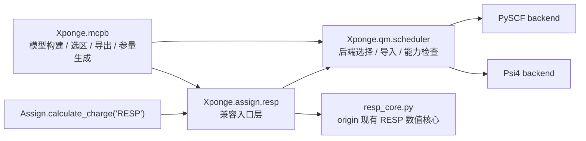

# Xponge QM 后端与 MCPB 迁移计划

## 1. 目标

本计划的目标是把 `Xponge-CPP` 中已经落地的两部分能力，按 `Xponge-origin` 的代码风格和运行时边界迁回到 `Xponge-origin`：

- 统一的、可选依赖式的 `QM` 后端架构
- 基于该 `QM` 架构的 `MCPB` scaffold 工作流

本次迁移应满足两个直接结果：

1. `Xponge-origin` 的 `RESP` 不再把 `PySCF` 写死在单个大文件中，而是通过统一 `QM` 调度层选择后端
2. `Xponge-origin` 获得与 `Xponge-CPP` 当前版本等价的 `MCPB` scaffold 能力，包括：
   - 金属中心环境选择
   - 小模型 / 大模型构建
   - 可选局部电荷重拟合
   - `blank / empirical / seminario` 三类参数产物路径
   - `SPONGE` 导出审计与辅助工件输出

## 2. 范围

### 2.1 本次包含

- 在 `Xponge-origin` 中新增 `Xponge/qm/` 子系统
- 迁移 `PySCF` 与 `Psi4` 的统一后端选择、能力声明、错误模型、调度 API
- 将 `Xponge/assign/resp.py` 从单体式实现拆分为：
  - 兼容入口层
  - 数值核心层
  - `QM` 后端适配层
- 迁移 `Xponge-CPP` 当前 `MCPB` scaffold 的 Python 工作流模块
- 为 `MCPB` 补齐 `origin` 兼容 helper 或改写为 `origin` 现有 API
- 新增面向 `RESP` / `QM` / `MCPB` 的单元测试
- 补充必要文档与用户入口

### 2.2 本次不包含

- 将 `Xponge-CPP` 的 C++ `RESP core` 一并迁回 `origin`
- 自动识别金属配位环境或自动推断 `bonded_pairs`
- 与 Amber `MCPB.py` 的全量功能对齐
- 覆盖所有金属元素、价态、几何和经验参数模型
- 把 `Psi4` 变成基础依赖或重度集成测试前提

## 3. 现状摘要

### 3.1 `Xponge-origin` 当前状态

- `RESP` 集中在 [Xponge/assign/resp.py](/mnt/data8t/Software/Xponge/Xponge-origin/Xponge/assign/resp.py)
- 文件顶层直接导入 `pyscf`
- `Assign.calculate_charge()` 只把 `"RESP"` 当作一个 `PySCF` 特化路径处理
- 当前没有统一的 `QM` 数据模型、能力集合、后端选择器和错误体系
- 当前也没有可以直接复用给 `MCPB` 的通用：
  - `compute_esp_on_grid(...)`
  - `optimize_geometry(...)`
  - `compute_hessian(...)`

### 3.2 `Xponge-CPP` 当前状态

`Xponge-CPP` 已经形成比较清晰的四层结构：

1. `qm/` 后端无关层
2. `qm/backends/` 后端适配层
3. `assign/resp.py` 兼容入口层
4. `mcpb/` 工作流层

其中 `MCPB` 已经依赖统一 `QM` API，而不是自己直接管理 `PySCF` / `Psi4`。

### 3.3 关键结论

迁移顺序必须是：

1. 先迁 `QM` 可选依赖架构
2. 再用该架构重构 `RESP`
3. 最后迁 `MCPB`

如果跳过前两步直接迁 `MCPB`，后续会在 `MCPB` 内重复写后端选择、依赖隔离、错误提示和 Hessian 能力判断，结构会变差。

## 4. 设计原则

### 4.1 保持 `origin` 数值核心

本次迁的是“架构”和“工作流”，不是把 `origin` 改造成 `Xponge-CPP` 的运行时镜像。  
`origin` 现有 `RESP` 数值实现应保留，并抽成 `resp_core.py`；不要在这次把 C++ `RESP core` 也带进来。

### 4.2 统一调度，分离后端

所有与量化后端选择、导入、能力差异、平台提示有关的逻辑，应集中到 `Xponge/qm/`，不要再次分散进：

- `assign/resp.py`
- `mcpb/charge_refit.py`
- `mcpb/seminario.py`

### 4.3 明确能力边界

`QM` 层需要显式表达能力支持，而不是调用时报错后再猜测。  
特别是：

- `PySCF`：支持 `SCF / ESP / optimize / Hessian`
- `Psi4`：当前只要求支持 `SCF / ESP / optimize`
- `Psi4 Hessian`：本次不作为必需能力，调用时应抛出明确的 capability error

### 4.4 迁移当前 MCPB scaffold，而不是口头升级

本次目标是复现 `Xponge-CPP` 当前这版 `MCPB` scaffold，接受其当前约束：

- 需要显式 `ion_ids`
- bonded 模式需要显式 `bonded_pairs`
- 经验参数覆盖有限
- `seminario` 依赖 Hessian

不要在本计划里隐含承诺“自动化完整金属参数化”。

### 4.5 保持 `origin` 用户接口稳定

- 旧的 `Assign.calculate_charge("RESP", ...)` 调用方式应继续可用
- 默认 `RESP` 后端应保持为 `pyscf`
- 若用户不指定 `backend`，现有脚本应尽量不受影响

## 5. 目标架构

## 6. 目标目录结构

计划中的新增或重构目录如下：

- `Xponge/qm/__init__.py`
- `Xponge/qm/api.py`
- `Xponge/qm/models.py`
- `Xponge/qm/capabilities.py`
- `Xponge/qm/errors.py`
- `Xponge/qm/scheduler.py`
- `Xponge/qm/backends/__init__.py`
- `Xponge/qm/backends/base.py`
- `Xponge/qm/backends/pyscf_backend.py`
- `Xponge/qm/backends/psi4_backend.py`
- `Xponge/assign/resp.py`
- `Xponge/assign/resp_core.py`
- `Xponge/mcpb/__init__.py`
- `Xponge/mcpb/api.py`
- `Xponge/mcpb/models.py`
- `Xponge/mcpb/selection.py`
- `Xponge/mcpb/model_builder.py`
- `Xponge/mcpb/charge_refit.py`
- `Xponge/mcpb/frcmod.py`
- `Xponge/mcpb/seminario.py`
- `Xponge/mcpb/export.py`

## 7. 文件级迁移映射

### 7.1 `QM` 架构

| `Xponge-CPP` 来源 | `Xponge-origin` 目标 | 迁移方式 | 备注 |
| --- | --- | --- | --- |
| `src/XpongeCPP/qm/models.py` | `Xponge/qm/models.py` | 基本直迁，局部命名调整 | 保留 `QMMolecule`、`SCFResult`、`ESPResult`、`OptimizationResult`、`HessianResult` |
| `src/XpongeCPP/qm/capabilities.py` | `Xponge/qm/capabilities.py` | 基本直迁 | 保留 capability set |
| `src/XpongeCPP/qm/errors.py` | `Xponge/qm/errors.py` | 基本直迁 | 明确 import / selection / capability 错误 |
| `src/XpongeCPP/qm/backends/base.py` | `Xponge/qm/backends/base.py` | 基本直迁 | 若 `origin` 风格不同，适度简化 ABC 层 |
| `src/XpongeCPP/qm/backends/pyscf_backend.py` | `Xponge/qm/backends/pyscf_backend.py` | 中度改写 | 适配 `origin Assign` 与坐标/电荷数据结构 |
| `src/XpongeCPP/qm/backends/psi4_backend.py` | `Xponge/qm/backends/psi4_backend.py` | 中度改写 | 保持轻量能力集，不要求 Hessian |
| `src/XpongeCPP/qm/scheduler.py` | `Xponge/qm/scheduler.py` | 中度改写 | 保留统一入口，适配 `origin` 导入风格 |
| `src/XpongeCPP/qm/api.py` | `Xponge/qm/api.py` | 轻度改写 | 作为稳定用户 API 再导出 |
| `src/XpongeCPP/qm/__init__.py` | `Xponge/qm/__init__.py` | 轻度改写 | 汇总公共入口 |

### 7.2 `RESP` 重构

| 当前 `origin` 文件 | 目标状态 | 迁移方式 | 备注 |
| --- | --- | --- | --- |
| `Xponge/assign/resp.py` | `resp.py + resp_core.py` | 拆分重构 | 保留现有数学实现，抽离后端调度 |
| `Xponge/assign/__init__.py` | 扩展 `calculate_charge` dispatch | 小改 | 新增 `backend`、必要时新增 `core` 参数 |

`RESP` 部分应特别区分：

- `resp.py`：用户入口、参数兼容、后端选择、网格生成、ESP 获取、调度数值内核
- `resp_core.py`：保留当前 `origin` 的 RESP SCF / second-stage / restrain / matrix 求解逻辑

### 7.3 `MCPB` 迁移

| `Xponge-CPP` 来源 | `Xponge-origin` 目标 | 迁移方式 | 备注 |
| --- | --- | --- | --- |
| `src/XpongeCPP/mcpb/models.py` | `Xponge/mcpb/models.py` | 基本直迁 | 数据模型基本可保留 |
| `src/XpongeCPP/mcpb/selection.py` | `Xponge/mcpb/selection.py` | 轻度改写 | 保留显式 `bonded_pairs` 要求 |
| `src/XpongeCPP/mcpb/export.py` | `Xponge/mcpb/export.py` | 轻度改写 | 适配 `origin` 的 `save_pdb` / `save_sponge_input` |
| `src/XpongeCPP/mcpb/frcmod.py` | `Xponge/mcpb/frcmod.py` | 轻度改写 | 保持 blank / empirical / seminario artifact 生成 |
| `src/XpongeCPP/mcpb/charge_refit.py` | `Xponge/mcpb/charge_refit.py` | 中度改写 | 改接 `origin` 的 `Assign` 与新 `RESP` 接口 |
| `src/XpongeCPP/mcpb/seminario.py` | `Xponge/mcpb/seminario.py` | 中度改写 | 改接 `Xponge.qm.compute_hessian(...)` |
| `src/XpongeCPP/mcpb/model_builder.py` | `Xponge/mcpb/model_builder.py` | 重写式迁移 | `XpongeCPP._core` 相关接口改为 `origin Molecule/Residue/ResidueLink` API |
| `src/XpongeCPP/mcpb/api.py` | `Xponge/mcpb/api.py` | 中度改写 | 顶层编排，接入 `origin` helper 与导出路径 |
| `src/XpongeCPP/mcpb/__init__.py` | `Xponge/mcpb/__init__.py` | 轻度改写 | 导出公共 API |

## 8. `origin` 需要补的兼容层

`Xponge-CPP` 的 `MCPB` 实现中，存在一批 `origin` 当前没有同名 helper 的便利接口。  
迁移时有两种策略：

1. 新增小型兼容 helper
2. 直接在 `MCPB` 模块内改写为 `origin` 原生 API

本计划建议优先采用“少量兼容 helper + 局部改写”的混合方式。

### 8.1 建议新增的 helper

- Amber `mol2` 模板注册 helper
- Amber `frcmod` 注册 helper
- 模板是否存在的查询 helper
- 已注册模板对象提取 helper

这些 helper 可以作为 `MCPB` 所需的薄封装存在，不必暴露成复杂的公共框架。

### 8.2 建议直接改写的部分

- `model_builder.py` 中对局部模型复制、残基链接重建、上下文残基拼接的逻辑
- `api.py` 中对离子模板载入、空白参数覆盖、产物审计的执行链

## 9. 分阶段实施计划

## 9.1 Phase 1: 建立 `QM` 基础层

### 目标

在 `origin` 中落地统一 `QM` 后端架构，但暂时不动 `RESP` 外部行为。

### 工作项

- 新建 `Xponge/qm/` 目录
- 迁入：
  - `models.py`
  - `capabilities.py`
  - `errors.py`
  - `backends/base.py`
  - `scheduler.py`
  - `api.py`
- 实现 `PySCF` 后端
- 实现 `Psi4` 后端
- 提供统一公开 API：
  - `run_scf`
  - `compute_esp_on_grid`
  - `optimize_geometry`
  - `compute_hessian`
  - `get_backend`
  - `get_capabilities`

### 验收标准

- `Xponge.qm.get_backend("pyscf")` 和 `("psi4")` 可用
- 缺依赖时错误提示明确
- `Psi4` 的 Hessian 路径能明确报 capability error，而不是模糊 ImportError

## 9.2 Phase 2: 拆分并重构 `RESP`

### 目标

将当前 `RESP` 重构为“入口层 + 数值核心层”，并切换到统一 `QM` 调度。

### 工作项

- 将当前 `Xponge/assign/resp.py` 的纯数值逻辑迁入 `resp_core.py`
- 保留现有：
  - MK 网格生成
  - second-stage grouping
  - restraint 逻辑
  - SCF 迭代求解
- 在新的 `resp.py` 中负责：
  - 参数兼容
  - `backend` 选择
  - `opt` 流程
  - ESP 计算调度
  - 将网格与 ESP 喂给 `resp_core`
- 在 `Assign.calculate_charge()` 中增加 `backend` 参数透传

### 验收标准

- 旧调用：
  - `assign.calculate_charge("RESP")`
  - `assign.calculate_charge("RESP", basis="6-31g*")`
  仍然可用
- 新调用：
  - `assign.calculate_charge("RESP", backend="pyscf")`
  - `assign.calculate_charge("RESP", backend="psi4")`
  可用
- 当前已经修好的 second-stage hydrogen grouping 回归不丢失

## 9.3 Phase 3: `QM` / `RESP` 测试补齐

### 目标

在迁入 `MCPB` 前，把后端架构和 `RESP` 编排层先锁稳。

### 工作项

- 迁移并裁剪 `Xponge-CPP` 中与 `RESP` / `QM` 相关的测试思想
- 保留接口和错误语义测试
- 将数值测试控制在小分子 smoke 范围

### 验收标准

- `RESP` 默认后端行为明确
- 未知后端、缺依赖、能力缺失都能稳定失败
- `PySCF` smoke 测试通过
- `Psi4` 的轻量 smoke / import-hint 测试通过

## 9.4 Phase 4: 迁移 `MCPB` 数据模型与无 QM 依赖模块

### 目标

先迁最稳定、最少依赖的 `MCPB` 结构层。

### 工作项

- 迁入：
  - `models.py`
  - `selection.py`
  - `export.py`
  - `frcmod.py`
- 先不接入 `seminario`
- 先不做大规模模板兼容整理

### 验收标准

- 可以构造 `MCPBRequest` / `MCPBResult`
- 可以对离子信息、环境选区和导出审计做基本验证

## 9.5 Phase 5: 迁移 `MCPB` 模型构建与局部电荷重拟合

### 目标

让 `origin` 具备与 `Xponge-CPP` 当前版本对等的小模型 / 大模型构建和局部 RESP refit 流程。

### 工作项

- 重写式迁移 `model_builder.py`
- 改写 `charge_refit.py` 为 `origin` 兼容版本
- 在 `api.py` 中串起：
  - 选择环境
  - 复制局部模型
  - 修补 parent residue link
  - 执行可选 RESP refit
  - 回写局部电荷覆盖

### 验收标准

- bonded 模式强制要求显式 `bonded_pairs`
- local RESP refit 可以补丁式回写到 parent molecule
- 可生成供 `SPONGE` 使用的单离子 / 小模型导出材料

## 9.6 Phase 6: 迁移 `seminario` 与完整 MCPB API

### 目标

补上依赖 Hessian 的路径，并暴露顶层 `MCPB` 入口。

### 工作项

- 迁入并改写 `seminario.py`
- 在 `api.py` 中接入 `blank / empirical / seminario`
- 在 `Xponge/__init__.py` 中导出：
  - `MCPB`
  - 相关结果对象或辅助函数

### 验收标准

- `blank` 方法可输出空白参数工件
- `empirical` 方法可生成非零力常数工件
- `seminario` 方法在 `PySCF` 可用时可跑通 Hessian 路径
- `Psi4` 走 `seminario` 时给出清晰的“当前后端不支持 Hessian”错误

## 10. 测试策略

## 10.1 总体原则

- 优先验证行为边界和调度语义，而不是追求大规模数值回归
- 对 `PySCF` 做小分子 smoke 级真实计算
- 对 `Psi4` 以轻量测试为主，避免把测试套件变成环境安装负担
- `MCPB` 以 scaffold 行为测试为主，不把“化学正确性全覆盖”作为本次测试目标

## 10.2 `QM` / `RESP` 测试

建议新增或扩展以下测试主题：

- 默认 `RESP` 后端为 `pyscf`
- `backend="pyscf"` 显式可用
- `backend="psi4"` 显式可用
- 未知后端报错语义正确
- 缺少 `PySCF` 时提示安装 `PySCF`
- Windows / 平台提示仍然合理
- `Psi4` 缺依赖时提示安装来源，例如 `conda-forge`
- `get_capabilities("pyscf")` / `("psi4")` 返回稳定
- `compute_hessian(..., backend="psi4")` 抛 `QMCapabilityError`
- `RESP` 的 second-stage hydrogen group 回归测试继续保留

## 10.3 `Psi4` 轻量测试策略

`Psi4` 的测试明确只做轻量覆盖，不要求：

- 与 `PySCF` 做大量数值对比
- 运行重分子、真实 Hessian、大量优化

推荐保留以下三类：

1. 缺依赖错误测试
   - monkeypatch / import failure
   - 错误消息包含 `Psi4` 与安装提示

2. 调度 smoke 测试
   - 若本机有 `psi4`，对一个很小的分子做一次 `SCF` 或 `ESP` smoke
   - 使用 `pytest.importorskip("psi4")` 类思路，避免强绑环境

3. capability 测试
   - 验证 `Psi4` 后端声明不支持 Hessian
   - `seminario` 路径对该限制给出清晰失败

## 10.4 `MCPB` 测试

建议迁移并裁剪 `Xponge-CPP/tests/test_mcpb_api.py` 的以下覆盖点：

- `MCPB` 返回结构化结果
- bonded 模式必须显式给出 `bonded_pairs`
- 非法元素符号拒绝
- 不支持的显式离子模板组合拒绝
- 推断 `ion_info` 时给出警告
- large model 可引入额外上下文残基
- local RESP refit 可补丁回写 parent charges
- `blank` 方法生成工件
- `empirical` 方法生成非零力常数工件
- `SPONGE` 导出审计与辅助 artifact 写出
- tier1 金属的 blank export readiness smoke

`seminario` 测试应以 monkeypatch Hessian 结果为主，不要求真实大计算。

## 11. 提交切分建议

建议至少拆成 6 组 commit，避免单个大提交混合“架构迁移 + 行为修改 + MCPB 接入”。

### Commit 1

- 新增 `Xponge/qm/` 基础文件
- 不改 `RESP` 调用方

### Commit 2

- 接入 `PySCF` / `Psi4` 后端
- 补 `QM` 调度与错误测试

### Commit 3

- 拆分 `RESP` 为 `resp.py + resp_core.py`
- 调整 `Assign.calculate_charge()`
- 补 `RESP` 兼容与回归测试

### Commit 4

- 新增 `Xponge/mcpb/models.py`
- `selection.py`
- `export.py`
- `frcmod.py`
- 补纯 scaffold 测试

### Commit 5

- 迁移 `model_builder.py`
- `charge_refit.py`
- `api.py` 的非 `seminario` 主流程
- 补 local model / charge patching / blank / empirical 测试

### Commit 6

- 迁移 `seminario.py`
- 接入 Hessian 路径
- 顶层导出 `MCPB`
- 补 capability 与 `seminario` 测试

## 12. 风险与缓解

### 12.1 `RESP` 行为回归

风险：

- 现有 `resp.py` 是单体式实现，拆分时容易打断隐式耦合

缓解：

- 先抽 `resp_core.py`，尽量保持原函数体不改语义
- 优先迁“封装边界”，后改“内部实现”

### 12.2 `Psi4` 环境负担

风险：

- 若测试强依赖 `psi4`，CI 或开发环境会变重

缓解：

- 对 `Psi4` 以 import-hint、capability、smoke 为主
- 将真实 `Psi4` 数值测试设为可跳过

### 12.3 `model_builder` 对 `_core` 的隐式依赖

风险：

- `Xponge-CPP` 中对 `_core` 或便捷模板函数的依赖在 `origin` 中不存在

缓解：

- 将 `model_builder.py` 视为“逻辑迁移”，而不是“逐行复制”
- 以 `origin Molecule / Residue / ResidueLink` 现有 API 为准重写

### 12.4 `seminario` 路径不稳定

风险：

- Hessian 返回矩阵形状、单位和原子索引映射最容易出错

缓解：

- 在 `QM` 层统一 Hessian 结果结构
- `seminario` 单测先用 monkeypatch 固定 Hessian，避免一次性叠加真实 QM 不确定性

## 13. 完成标准

以下条件同时满足，视为本计划完成：

- `Xponge-origin` 中存在稳定的 `Xponge.qm` 公共 API
- `RESP` 已通过统一 `QM` 层调度，并保留旧用户入口兼容性
- `PySCF` 可用于 `RESP`、`ESP`、优化与 Hessian 路径
- `Psi4` 可作为 `RESP` / `ESP` / 优化的可选后端，并对 Hessian 限制给出清晰错误
- `MCPB` scaffold 可以在 `origin` 中完成：
  - 环境选择
  - 小模型 / 大模型构建
  - 可选局部 RESP 重拟合
  - `blank / empirical / seminario` 参数工件生成
  - `SPONGE` 导出审计
- 相关测试在“无 `Psi4`”环境下仍可大部分通过；`Psi4` 测试只作为轻量可跳过增强项

## 14. 推荐执行顺序

实际实施时，建议严格按以下顺序推进：

1. `QM` 基础层
2. `PySCF` / `Psi4` 后端
3. `RESP` 解耦
4. `QM` / `RESP` 测试锁稳
5. `MCPB` 结构层
6. `MCPB` 模型构建与 local refit
7. `seminario`
8. 顶层 API 与文档收尾

这条顺序的核心目的是：先把底座锁稳，再让 `MCPB` 依赖它，而不是反过来把 `MCPB` 变成后端架构的试验场。
