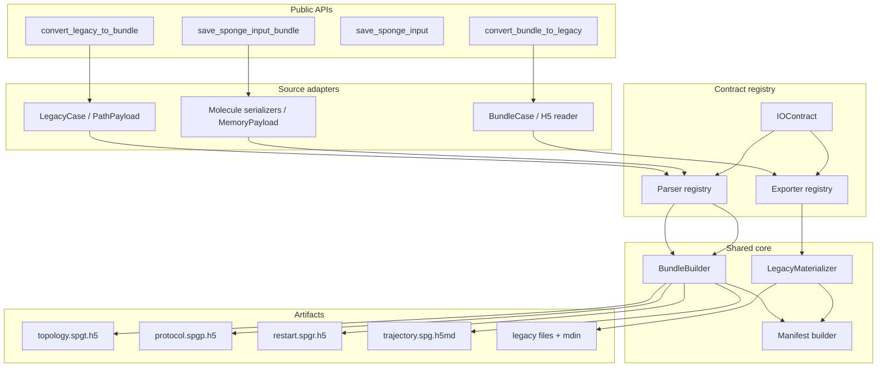

# XPONGE bundled 输入双向转换与保存接口集成计划

## 1. 文档状态

- 日期：2026-07-11
- 目标分支：`feat/io-bundle-converter`
- 当前基线提交：`b495cb0 Add legacy I/O bundle converter`
- 当前测试基线：io_bundle 聚焦套件 `96 passed`
- 本文状态：实施与代码整理完成

实施记录（2026-07-11）：

- 已完成 contract registry、bundle reader、typed exporter、legacy materializer、双向 CLI 和 reverse manifest
- 已抽取共享 `BundleBuilder`，正向 converter 与 object saver 共用 HDF5 写入和 finalize 逻辑
- 已提供 `save_sponge_input_bundle`，覆盖 `Molecule`、`Residue`、`ResidueType`、名称 metadata 与动态 listed force
- 已补齐 contract、topology/state/trajectory roundtrip、fallback、安全、CLI 与 saver parity harness
- 宽回归历史结果为 `174 passed, 1 skipped, 5 failed`；其中原有 skip 已通过本次 probe 修正消除，5 个失败均位于既有非 bundle 测试，原因分别为既有测试找不到 PATH 中的 SPONGE、固定 AmberTools 数据路径不存在，以及既有全局残基注册顺序依赖
- 真实 SPONGE reverse legacy smoke 已通过；restart probe 现在接受缺少可选 velocity 的 structural restart，并验证 SPONGE assembler 将速度置零
- saver 生成的无 velocity bundled 三件套已直接通过真实 SPONGE 初始化，运行时输出确认 `All velocity will be set to 0`

整理记录（2026-07-13）：

- 将共享 legacy case 数据生成器移入 `io_bundle_fixtures.py`，移除测试模块之间的反向导入
- 将 XPONGE serializer 到 typed dataset 的适配职责移入 `molecule_adapter.py`
- 正向 converter 在一次转换中复用同一个 `BundleBuilder` 实例
- builder 的 dataset hash 跟踪改为显式策略：object saver 启用，落盘后计算 hash 的 converter 关闭，避免大轨迹常驻内存

本文将以下两个后续任务拆成一套可执行的整体设计：

1. 完成 bundled 输入向 direct/legacy 分文件输入的转换
2. 增加与 `save_sponge_input` 对应的 bundled 输入保存接口

本文中的 **direct/legacy** 统一指 SPONGE 现有的“一组文本或二进制文件 + mdin/命令行文件绑定”输入形式。实现中只维护一个 `bundle -> legacy` 转换核心；如果用户接口需要 `direct` 术语，应以别名提供，不能复制第二套实现。

## 2. 背景与现状

当前 `Xponge/io_bundle/` 已经具备：

- direct/legacy 输入目录扫描与 mdin 解析
- direct/legacy 输入到 bundled HDF5/H5MD 的转换
- topology、protocol、restart、rerun trajectory 的 typed parser
- legacy sidecar 和 compatibility payload 保留
- bundled mdin 生成
- legacy output 到 H5MD output bundle 的转换
- conversion manifest
- SPONGE H5 probe 兼容性测试

关键现有文件：

- `Xponge/io_bundle/converter.py`
- `Xponge/io_bundle/contracts.py`
- `Xponge/io_bundle/legacy_case.py`
- `Xponge/io_bundle/topology_parsers.py`
- `Xponge/io_bundle/state_parsers.py`
- `Xponge/io_bundle/trajectory_parsers.py`
- `Xponge/io_bundle/h5_writer.py`
- `Xponge/io_bundle/manifest.py`
- `Xponge/io_bundle/cli.py`
- `Xponge/tools/unittests/test_1_io_bundle.py`

`save_sponge_input` 当前位于 `Xponge/build.py`，其核心行为是：

1. 将 `Molecule`、`Residue`、`ResidueType` 统一处理为 `Molecule`
2. 重排 residue，保证相连分子块连续
3. 构建 bonded force
4. 校验 SPONGE atom component 连续性
5. 调用 `Molecule._save_functions` 中注册的 serializer
6. 写出 `<prefix>_<key>.txt`
7. 返回构建后的 `Molecule`

bundled saver 必须复用上述准备和 serializer 注册体系，不能形成一套独立的力场遍历实现。

## 3. 总体目标

### 3.1 功能目标

最终提供以下公共能力：

```python
from Xponge.io_bundle import convert_bundle_to_legacy

manifest = convert_bundle_to_legacy(
    bundle_root,
    output_dir,
    mdin="mdin.bundled.spg.toml",
    prefix="system",
    strict=True,
    dry_run=False,
)
```

以及：

```python
import Xponge

mol = Xponge.save_sponge_input_bundle(
    molecule,
    prefix="system",
    dirname="inputs",
)
```

### 3.2 语义目标

- typed HDF5 dataset 是 bundled 输入的权威数据源
- legacy sidecar 只承担格式保真、尚未支持的 typed 逆向导出和诊断用途
- bundled 中 typed dataset 被修改后，逆向转换必须反映修改后的数据
- direct -> bundle -> direct -> bundle 的结果按 typed dataset 语义等价
- `save_sponge_input` 与 `save_sponge_input_bundle` 对同一 `Molecule` 产生语义等价的 SPONGE 输入
- normal、rerun、restart load policy 和 custom force 均有明确行为
- 不支持的 serializer 或 bundle schema 必须显式报错或写入 manifest，不能静默丢弃

### 3.3 兼容目标

- 不破坏现有 `convert_legacy_to_bundle` API
- 不改变现有 legacy manifest 的 schema 和已存在字段含义
- 不改变 `save_sponge_input` 的参数、返回值和文件内容
- `h5py` 仍为 bundled 输入功能的必要依赖
- Python 最低版本保持项目当前的 `>=3.10`

## 4. 非目标

本轮不包含：

- 从 bundled topology 重新构造完整 XPONGE `Molecule` 对象
- 把 output bundle 重新导出成所有 legacy output 文件
- 改写 SPONGE bundled schema
- 为未知未来 schema 猜测兼容行为
- 改变现有 SPONGE legacy 文件格式
- 用第二套 forcefield traversal 取代 `Molecule._save_functions`
- 在本轮重构整个 `Xponge/build.py`

## 5. 核心设计结论

### 5.1 direct/legacy 只保留一个内部目标格式

内部命名统一使用 `legacy`：

- API：`convert_bundle_to_legacy`
- converter class：`BundleToLegacyConverter`
- CLI：`bundle-to-legacy`
- manifest：`xponge.bundle_to_legacy.manifest`

如需 direct 用户术语，只增加：

```python
convert_bundle_to_direct = convert_bundle_to_legacy
```

CLI 不增加重复命令，文档中说明 direct/legacy 等价。

### 5.2 typed 优先，sidecar 后备

逆向 materialization 优先级固定为：

1. typed dataset exporter
2. HDF5 中作为正式字段保存的 embedded text/bytes
3. `/parameters/sponge/files/legacy_sidecars`
4. `/compatibility/legacy_import/<key>/raw_text`
5. `/compatibility/legacy_import/<key>/raw_bytes`
6. unsupported/error

禁止行为：

- typed exporter 可用时直接复制旧 sidecar
- 因 sidecar 文件名更接近原始文件名而覆盖 typed 数据
- sidecar 不存在时无提示跳过已声明的输入 contract

### 5.3 parser/exporter 以 contract 为中心配对

每个可逆 contract 必须能回答：

- 从哪个 bundle 文件读取
- 需要哪些 dataset
- legacy key 是什么
- 输出文件名如何生成
- 使用哪个 exporter
- 是否允许 sidecar fallback
- 比较规则是什么
- 是否支持 normal/rerun
- 是否存在别名冲突

不能继续只靠 converter 内部 `if key == ...` 分散决定逆向行为。

### 5.4 共享 BundleBuilder，不共享临时目录工作流

`save_sponge_input_bundle` 不应通过“写一套临时 legacy 文件，再调用完整 CLI converter”来实现。这样会产生：

- manifest 泄露临时路径
- 不必要的磁盘 I/O
- 错误定位跨越两层用户接口
- saver 和 converter 输出元数据容易漂移

应抽取共享 `BundleBuilder`：

- legacy converter：`Path payload -> parser -> typed datasets -> BundleBuilder`
- bundled saver：`serializer text -> in-memory payload -> parser -> typed datasets -> BundleBuilder`
- coordinate/box 可由 saver 直接形成 typed array

### 5.5 schema 版本必须显式校验

逆向 reader 在读取时检查：

- topology `/schema/name`
- topology `/schema/version`
- protocol `/schema/name`
- protocol `/schema/version`
- restart `/parameters/sponge/schema/*`
- trajectory `/parameters/sponge/schema/*`

第一版只接受当前 `xponge.legacy_to_bundle.v1`。未知 major/schema name 在 strict 模式下立即失败；非 strict 模式记录 manifest warning，但仍不能猜测未知 typed layout。

## 6. 目标架构



## 7. 分层职责

### 7.1 source adapter 层

负责把来源标准化，不负责格式转换策略。

- `LegacyCase`：mdin 和 legacy path 解析
- `BundleCase`：bundled mdin、H5 文件定位、schema 校验
- `PathPayload`：文件型 parser 输入
- `MemoryPayload`：serializer 文本或 bytes 的内存型 parser 输入

### 7.2 contract/registry 层

负责声明支持范围和路由：

- legacy key 到 bundle path
- parser/exporter id
- mode、component、payload kind
- filename policy
- fallback policy
- comparison rule

### 7.3 typed codec 层

负责具体格式编解码：

- parser：legacy payload -> `TypedDataset[]`
- exporter：bundle datasets -> legacy bytes/text

parser 和 exporter 不负责：

- 输出目录创建
- mdin 修改
- manifest 写入
- contract fallback 决策

### 7.4 builder/materializer 层

`BundleBuilder` 负责：

- HDF5 dataset/group/link 写入
- bundle schema metadata
- content/topology hash
- H5MD time axis
- minimal protocol
- bundle file naming

`LegacyMaterializer` 负责：

- 安全输出路径
- 文件覆盖策略
- text/bytes 写入
- mdin legacy binding 生成
- sidecar/compatibility fallback

### 7.5 orchestration 层

- `LegacyToBundleConverter`
- `BundleToLegacyConverter`
- `save_sponge_input_bundle`

只负责编排 source、contract、codec、builder/materializer 和 manifest。

## 8. 双向契约设计

### 8.1 `IOContract` 目标字段

在不破坏现有构造调用的前提下扩展：

```python
@dataclass(frozen=True)
class IOContract:
    contract_id: str
    legacy_keys: tuple[str, ...]
    bundle_file: str
    bundle_path: str
    direction: str
    modes: tuple[str, ...]
    component: str
    override_policy: str
    comparison_rule: str
    status: str = "supported"
    payload_kind: str = "file"

    parser_id: str | None = None
    exporter_id: str | None = None
    required_bundle_paths: tuple[str, ...] = ()
    legacy_filename_stem: str | None = None
    legacy_section: str | None = None
    reverse_policy: str = "typed_or_sidecar"
    aliases: tuple[str, ...] = ()
```

字段语义：

- `parser_id`：正向 codec registry key
- `exporter_id`：逆向 codec registry key
- `required_bundle_paths`：exporter 启动前的完整性检查
- `legacy_filename_stem`：默认 `<prefix>_<stem>.txt`
- `legacy_section`：例如 `EAM`、`TERSOFF`、`REAXFF`
- `reverse_policy`：
  - `typed_required`
  - `typed_or_sidecar`
  - `embedded_text`
  - `sidecar_only`
  - `not_reversible`
- `aliases`：例如 `virtual_atom_in_file` 与 `virtual_atoms_in_file`

### 8.2 contract 唯一性规则

- `contract_id` 全局唯一
- 同一 mode 下，同一 `bundle_file + bundle_path` 最多一个 canonical exporter
- alias 不能各自生成重复文件
- `coordinate_in_file` 对应 position 和 box 两个 contract，但必须由一个 coordinate materialization group 协同输出
- `hill_in_file`、`hills_in_file`、`metad_hills_in_file` 只能选一个 canonical legacy key
- `improper_in_file`、`improper_dihedral_in_file` 同理

### 8.3 materialization group

单个 legacy 文件可能由多个 bundle dataset 构成，因此增加 group 概念：

```python
materialization_group: str | None
```

至少包含：

- `restart.coordinate_file`
  - position
  - box edges
- `protocol.constraint_file`
  - atoms
  - r0
- `topology.lj_file`
  - coefficient A
  - coefficient B
  - atom type
- `topology.cmap_file`
- `restart.amber_rst7_file`

同一 group 只 materialize 一次，manifest 可为每个 contract 分别记录同一 target path。

### 8.4 reverse status

逆向 manifest entry 使用以下 status：

- `typed_exported`
- `embedded_exported`
- `sidecar_restored`
- `compatibility_restored`
- `scalar_preserved`
- `mdin_binding_generated`
- `skipped_not_present`
- `unsupported`
- `schema_mismatch`
- `validation_failed`

### 8.5 数据权威和 stale sidecar

sidecar table 当前只记录 key/path，不能证明 sidecar 与 typed dataset 仍一致。第一版规则：

- 存在 exporter：永远使用 typed exporter
- 不存在 exporter：允许 sidecar fallback
- `prefer_sidecars` 不作为公共参数，防止产生不一致语义
- 如未来确有格式精确保真需求，应增加 typed content hash 后再设计 opt-in 行为

## 9. BundleCase 与安全模型

### 9.1 `BundleCase` 数据模型

```python
@dataclass(frozen=True)
class BundleCase:
    root: Path
    mdin_path: Path
    mdin_text: str
    commands: dict[str, str]
    topology_path: Path | None
    protocol_path: Path | None
    restart_path: Path | None
    trajectory_path: Path | None
    restart_load: str | None
    particle_stream: str
```

### 9.2 path 解析规则

- 相对 H5 path 以 bundled mdin 所在目录为基准
- 所有 sidecar 相对路径以 bundle root 为基准
- sidecar resolve 后必须仍位于 bundle root 内
- 拒绝 `..` 越界和指向目录的 sidecar
- 逆向输出 target 必须位于 output root 内
- 默认不覆盖已有文件

### 9.3 overwrite 策略

公共 API 增加：

```python
overwrite: bool = False
```

- `False`：任何 target 冲突都在写入前统一报错
- `True`：只允许覆盖本次 manifest 中计划生成的文件
- 禁止递归删除输出目录
- dry-run 也必须检测冲突

### 9.4 schema 和 cross-file 校验

校验项目：

- schema name/version
- topology atom count
- position/velocity atom dimension
- residue offset 和 atom count
- protocol topology compatibility hash
- rerun particle stream 是否存在
- position、velocity、box frame count 是否兼容
- restart load policy 与实际 component 是否相容
- sidecar key/path 数组长度一致

## 10. typed exporter 设计

### 10.1 exporter 统一接口

```python
@dataclass(frozen=True)
class LegacyPayload:
    key: str
    filename: str
    data: str | bytes
    binary: bool = False


class BundleView(Protocol):
    def contains(self, bundle_file: str, dataset_path: str) -> bool: ...
    def read(self, bundle_file: str, dataset_path: str): ...
    def read_text(self, bundle_file: str, dataset_path: str) -> str: ...


Exporter = Callable[[IOContract, BundleView, ExportContext], list[LegacyPayload]]
```

### 10.2 数值格式规则

- atom index：十进制整数
- float32 typed dataset：输出足够支持 float32 roundtrip 的有效位数
- float64：至少 17 位有效数字或使用项目统一 formatter
- 不比较文本空白，比较 parser 后 typed 数据
- legacy binary trajectory：固定 little/native float32 行为必须与当前 parser 和 SPONGE 一致，并在测试中锁定
- NaN/Inf 默认拒绝导出，除非对应 contract 明确允许

### 10.3 box 逆变换

新增 `edges_to_box(edges)`：

- 输出 `lx ly lz alpha beta gamma`
- 使用向量长度和夹角计算
- 对 cos 值 clamp 到 `[-1, 1]`
- 拒绝零长度和奇异 cell
- roundtrip 以 `box_to_edges(edges_to_box(x))` 比较

### 10.4 protocol config

CV/restraint/SITS config typed layout 已保存：

- section name
- key offset
- key
- value

逆向统一输出当前 braced syntax：

```text
section
{
    key = value
}
```

不承诺恢复原始 TOML 或注释；如果没有 typed exporter，才恢复 sidecar 原文。

### 10.5 custom force

custom force 需要两阶段导出：

1. 从 pairwise/listed config typed datasets 导出定义文件
2. 根据 force name 和 parameter schema 导出动态 `<force_name>_in_file`

要求：

- HDF5 safe name 与原始 force name 映射不能靠反推
- 正向 bundle 必须保存 canonical force name
- parameter type/name/count 完整校验
- mdin 为动态 key 生成显式绑定

## 11. bundled mdin 到 legacy mdin

### 11.1 保留内容

保留：

- run policy scalar
- mode
- timestep/step limit
- thermostat/barostat
- output plan
- 用户未知但不与 H5 input binding 冲突的行和注释

### 11.2 移除内容

移除：

- `input_h5_topology_path`
- `input_h5_protocol_path`
- `input_h5_restart_path`
- `input_h5_restart_load`
- `input_h5_trajectory_path`
- `input_h5_trajectory_particle_stream`

### 11.3 legacy 绑定策略

默认生成显式文件绑定，保证转换结果不依赖隐式 filename 推断：

```toml
mass_in_file = "system_mass.txt"
charge_in_file = "system_charge.txt"
coordinate_in_file = "system_coordinate.txt"
```

`prefix` 仅控制文件名，不自动生成 `default_in_file_prefix`。后续如确认所有 contract 都满足标准 prefix 规则，可增加独立 `binding_style="default_prefix"`，但不进入第一版。

sectioned key 按 SPONGE 语法恢复，例如：

```toml
[EAM]
in_file = "system_EAM.txt"
atom_type_in_file = "system_EAM_atom_type.txt"
```

### 11.4 rerun

rerun 模式下：

- `crd` 写 float32 binary
- `vel` 写 float32 binary
- `box` 写六列文本
- 保留 `mode = "rerun"`
- frame count 以 position 为主轴
- 缺失可选 velocity/box 时不生成绑定

## 12. `save_sponge_input_bundle` 设计

### 12.1 公共接口

第一版接口：

```python
def save_sponge_input_bundle(cls, prefix=None, dirname="."):
    """Save an XPONGE object as SPONGE bundled input files.

    Returns the prepared Molecule, matching save_sponge_input.
    """
```

输出：

```text
<dirname>/<prefix>_topology.spgt.h5
<dirname>/<prefix>_protocol.spgp.h5
<dirname>/<prefix>_restart.spgr.h5
```

第一版不自动写完整 simulation mdin，因为 `save_sponge_input` 也不负责 run policy。文档提供绑定示例：

```toml
input_h5_topology_path = "system_topology.spgt.h5"
input_h5_protocol_path = "system_protocol.spgp.h5"
input_h5_restart_path = "system_restart.spgr.h5"
input_h5_restart_load = "structural"
```

### 12.2 输入对象处理

从 `save_sponge_input` 提取私有 helper：

```python
def _prepare_sponge_input_molecule(cls) -> Molecule: ...
def _iter_sponge_input_payloads(mol: Molecule): ...
```

`_prepare_sponge_input_molecule` 负责：

- `Molecule` 原对象处理
- `Residue` 转 `Molecule`
- `ResidueType` 转 `Residue` 再转 `Molecule`
- reorder/build/continuity check

现有 `save_sponge_input` 改为调用这两个 helper，但输出必须保持不变。

### 12.3 serializer 到 contract 的映射

增加显式 registry，不能只做字符串拼接：

| serializer key | legacy key | bundle component |
| --- | --- | --- |
| `coordinate` | `coordinate_in_file` | restart |
| `mass` | `mass_in_file` | topology |
| `charge` | `charge_in_file` | topology |
| `residue` | `residue_in_file` | topology |
| `exclude` | `exclude_in_file` | topology |
| `bond` | `bond_in_file` | topology |
| `angle` | `angle_in_file` | topology |
| `dihedral` | `dihedral_in_file` | topology |
| `improper_dihedral` | `improper_dihedral_in_file` | topology |
| `LJ` | `LJ_in_file` | topology |
| `nb14` | `nb14_in_file` | topology |
| `nb14_extra` | `nb14_extra_in_file` | topology |
| `urey_bradley` | `urey_bradley_in_file` | topology |
| `cmap` | `cmap_in_file` | topology |
| `gb` | `gb_in_file` | topology |
| `virtual_atom` | `virtual_atom_in_file` | topology |
| `LJ_soft_core` | `LJ_soft_core_in_file` | topology |
| `subsys_division` | `subsys_division_in_file` | topology |
| `SW` | `SW_in_file` | topology |
| `EDIP` | `EDIP_in_file` | topology |
| `listed_forces` | `listed_forces_in_file` | topology |

### 12.4 当前 serializer 覆盖缺口

以下注册项当前没有完整 bundled contract，实施 saver 前必须分类：

- `bond_soft`
- `Ryckaert_Bellemans`
- `fake_mass`
- `fake_LJ`
- `fake_charge`
- `resname`
- `atom_name`
- `atom_type_name`

处理规则：

- SPONGE bundled schema 已支持：补 contract、parser、exporter
- XPONGE 附加名称元数据：写到明确的 XPONGE metadata namespace
- schema 不支持：抛出 `BundleCapabilityError`，错误列出 serializer key
- serializer 返回 `None`：视为该体系不含对应项，不报错

禁止忽略一个返回非空 payload 的未知 serializer。

### 12.5 in-memory payload

新增轻量协议：

```python
class InputPayload(Protocol):
    name: str
    suffix: str

    def read_text(self, encoding="utf-8") -> str: ...
    def read_bytes(self) -> bytes: ...
```

实现：

- `PathPayload`
- `MemoryPayload`

逐步把 parser 参数从严格 `Path` 改为 `InputPayload`。错误消息仍显示 payload name。

### 12.6 原子名称元数据

建议保存：

- `/atoms/name`
- `/atoms/type_name`
- `/residues/name`

在确认 SPONGE schema 是否允许这些路径前，可先放到：

- `/parameters/xponge/atoms/name`
- `/parameters/xponge/atoms/type_name`
- `/parameters/xponge/residues/name`

最终位置必须由 SPONGE H5 probe 或 schema 测试确认，不能只依赖 h5py 可写性。

## 13. Harness 设计

### 13.1 harness 目标

harness 不只测试“函数没有报错”，而要验证双向语义、优先级和 SPONGE 可消费性。

分为五层：

1. codec unit harness
2. contract completeness harness
3. semantic roundtrip harness
4. saver parity harness
5. SPONGE executable/probe harness

### 13.2 codec unit harness

对每个 contract 执行：

```text
legacy fixture
  -> parser
  -> typed datasets A
  -> exporter
  -> legacy payload'
  -> parser
  -> typed datasets B
  -> compare(A, B, comparison_rule)
```

比较规则：

- `exact`
- `text_semantic`
- `int_array`
- `float32`
- `float64`
- `unordered_rows`
- `binary_float32`

### 13.3 contract completeness harness

自动检查：

- supported file contract 有 parser
- reversible contract 有 exporter
- required bundle path 非空且规范化
- materialization group 没有 exporter 冲突
- aliases 只有一个 canonical key
- saver registry 中非空 serializer 都被分类
- CLI/API 导出与 `__all__` 一致

### 13.4 semantic roundtrip harness

主链路：

```text
legacy case
  -> bundle A
  -> legacy case B
  -> bundle C
  -> semantic bundle comparison(A, C)
```

比较：

- dataset path 集合
- shape/dtype
- int exact
- float tolerance
- string exact或 config semantic
- schema metadata
- topology compatibility

不比较：

- HDF5 object address
- chunk/compression implementation detail
- 原始文本空白
- manifest 中的绝对 source path

### 13.5 authoritative typed data harness

专门测试 stale sidecar：

1. legacy -> bundle
2. 修改 `/atoms/mass` 或 `/forcefield/bond/k`
3. 保持 sidecar 不变
4. bundle -> legacy
5. 重新 parse legacy
6. 断言得到修改后的 typed 值

这是逆向转换最重要的回归门槛之一。

### 13.6 saver parity harness

对同一 molecule：

```text
save_sponge_input -> legacy A
save_sponge_input_bundle -> bundle B
bundle B -> legacy C
parse A/C -> compare typed semantics
```

覆盖对象：

- `Molecule`
- `Residue`
- `ResidueType`
- 普通 Amber forcefield
- GB
- FEP/LJ soft core
- virtual atom
- CMAP
- 空 bonded force 项

### 13.7 SPONGE probe harness

继续使用已有可选 probe：

- `h5_restart_read_probe`
- `h5_trajectory_read_probe`

新增或接入：

- topology read probe
- protocol read probe
- bundled saver 三件套 load probe
- reverse 后 legacy SPONGE smoke run

probe 不存在时测试可 skip，但 CI/集成环境必须至少有一条真实 SPONGE 验证流水线。

### 13.8 测试 fixture 组织

原有 `_write_basic_case` 已从测试模块移入
`Xponge/tools/unittests/io_bundle_fixtures.py`，并以 `write_basic_case` 作为共享入口；
fixture helper 不包含断言，reverse 测试不再反向导入主测试模块。

如果后续出现需要独立组合的 fixture，再按实际调用面继续拆成
`write_minimal_normal_case`、`write_full_rerun_case`、`write_custom_force_case`、
`write_restart_policy_case` 和 `write_sidecar_fallback_case`，避免预先复制未被使用的数据生成路径。

## 14. 错误模型

建议新增：

```python
class BundleError(RuntimeError): ...
class BundleSchemaError(BundleError): ...
class BundleValidationError(BundleError): ...
class BundleExportError(BundleError): ...
class BundleCapabilityError(BundleError): ...
class BundlePathError(BundleError): ...
class BundleConflictError(BundleError): ...
```

兼容策略：

- 现有 `ConversionError` 暂时保留
- 后续可让其继承 `BundleError`
- 公共 API 错误必须包含 contract id、bundle file/path、目标 legacy key
- codec 内部 `ValueError` 在 orchestration 边界包装，并保留 `raise ... from exc`

## 15. Manifest 设计

### 15.1 向后兼容扩展

`ManifestEntry` 增加可选字段：

```python
target_path: str | None = None
source_kind: str | None = None
warnings: list[str] | None = None
```

旧 manifest 不受影响，因为 `None` 字段仍不输出。

### 15.2 逆向 manifest

```python
@dataclass
class ReverseConversionManifest:
    schema: str = "xponge.bundle_to_legacy.manifest"
    schema_version: int = 1
    bundle_root: str = ""
    output_root: str = ""
    mode: str = "normal"
    entries: list[ManifestEntry] = field(default_factory=list)
    generated_mdin: str | None = None
```

### 15.3 dry-run

dry-run 必须执行：

- bundle scan
- schema validation
- contract route
- required dataset validation
- path conflict validation
- exporter capability validation

dry-run 不执行：

- 文件写入
- output directory 创建
- HDF5 修改

## 16. 代码风格与实现约束

### 16.1 风格

- 遵循仓库当前 Python 风格，不引入新的 formatter 配置
- 新模块使用 `from __future__ import annotations`
- 公共函数和 class 必须有 docstring
- 私有 codec helper 只在行为不直观时写简短 docstring
- 类型标注覆盖新公共 API、dataclass、registry 和 protocol
- 路径参数统一接受 `str | Path`
- 内部尽早转为 resolved `Path`
- HDF5 path 始终使用 `/` 开头

### 16.2 命名

- 正向：`parse_*`、`LegacyToBundle*`
- 逆向：`export_*`、`BundleToLegacy*`
- 写 HDF5：`BundleBuilder`
- 写 legacy 文件：`LegacyMaterializer`
- 不使用含糊的 `convert_back`、`reverse_convert`
- bundle 文件名常量集中定义

### 16.3 registry

- registry 在模块 import 时静态构建
- 未知 registry id 在启动转换前失败
- 不通过动态 import string 加载 codec
- contract table 和 codec registry 分离，避免循环导入

### 16.4 HDF5 I/O

- reader 应尽量一次打开一个 H5 文件，并通过 context manager 关闭
- 不在每个 dataset read 时反复打开同一文件
- writer 第一阶段可复用现有 helper，抽取 `BundleBuilder` 后再集中 handle 生命周期
- 不依赖 HDF5 group 遍历顺序
- string dataset 统一 decode helper

### 16.5 文件写入

- 代码修改使用项目既有写入方式
- legacy materialization 先计划所有 target，再写入
- 单文件写入优先使用临时文件 + replace，避免半写文件
- manifest 最后写入
- 发生失败时不删除用户已有文件

### 16.6 依赖和循环导入

- `Xponge/build.py` 不在模块顶层导入整个 `Xponge.io_bundle`
- bundled saver 实现放在 `Xponge/io_bundle/saver.py`
- `build.py` 只保留准备 helper 或用局部 import 暴露 wrapper
- `Xponge/__init__.py` 在 `build` 和 `io_bundle` 初始化顺序稳定后导出 saver

### 16.7 测试风格

- 新测试优先使用 `pytest` fixture 和 `tmp_path`
- 不继续扩展单个 2800+ 行测试文件
- H5 assert 通过统一 helper
- 可选 SPONGE probe 测试显式 skip reason
- 不 monkeypatch 全模块 writer 来替代核心 roundtrip 测试

## 17. 逐文件接口设计

### 17.1 `Xponge/io_bundle/contracts.py`

修改：

- 扩展 `IOContract`
- 增加 reverse policy/materialization group 常量
- 为现有 contract 补 parser/exporter id
- 增加 contract validation helper

目标接口：

```python
def contracts_by_legacy_key() -> dict[str, tuple[IOContract, ...]]: ...
def contracts_by_bundle_file() -> dict[str, tuple[IOContract, ...]]: ...
def reversible_contracts(mode: str) -> tuple[IOContract, ...]: ...
def validate_contract_registry() -> None: ...
```

### 17.2 `Xponge/io_bundle/payloads.py`（新增）

职责：Path/内存 payload 抽象。

```python
class InputPayload(Protocol): ...

@dataclass(frozen=True)
class PathPayload: ...

@dataclass(frozen=True)
class MemoryPayload: ...
```

### 17.3 `Xponge/io_bundle/bundle_case.py`（新增）

职责：bundled mdin 和 H5 bindings 扫描。

```python
@dataclass(frozen=True)
class BundleCase: ...

def scan_bundle_case(
    bundle_root: str | Path,
    mdin: str | Path = "mdin.bundled.spg.toml",
    *,
    strict: bool = True,
) -> BundleCase: ...
```

### 17.4 `Xponge/io_bundle/bundle_reader.py`（新增）

职责：HDF5 handle 生命周期、typed read、string decode、sidecar table。

```python
class BundleReader:
    def __enter__(self) -> "BundleReader": ...
    def __exit__(self, *exc_info) -> None: ...
    def contains(self, bundle_file: str, path: str) -> bool: ...
    def read(self, bundle_file: str, path: str): ...
    def read_text(self, bundle_file: str, path: str) -> str: ...
    def read_legacy_sidecars(self, bundle_file: str) -> dict[str, Path]: ...
    def validate(self) -> list[str]: ...
```

### 17.5 `Xponge/io_bundle/bundle_builder.py`（新增）

从 `converter.py` 抽取：

- H5 dataset 写入
- metadata
- hash
- restart/trajectory finalize
- minimal protocol

```python
class BundleBuilder:
    def add_datasets(self, bundle_file: str, datasets) -> None: ...
    def add_legacy_sidecar(self, bundle_file: str, key: str, payload) -> None: ...
    def ensure_required_inputs(self, *, mode: str) -> None: ...
    def finalize(self, metadata: BundleMetadata) -> None: ...
```

### 17.6 `Xponge/io_bundle/topology_parsers.py`

修改：

- parser 参数改为 `InputPayload`
- 保留传入 `Path` 的兼容 wrapper
- parser route 与 contract parser id 对齐

目标入口：

```python
def parse_topology_payload(parser_id: str, payload: InputPayload) -> list[TypedDataset] | None: ...
```

原 `parse_topology_file(key, path)` 保留并委托新入口。

### 17.7 `Xponge/io_bundle/state_parsers.py`

与 topology parser 同样改造：

```python
def parse_state_payload(parser_id: str, payload: InputPayload) -> list[TypedDataset] | None: ...
```

保留 `parse_protocol_or_restart_file` 兼容入口。

### 17.8 `Xponge/io_bundle/trajectory_parsers.py`

新增 memory bytes 支持：

```python
def parse_trajectory_payload(
    parser_id: str,
    payload: InputPayload,
    *,
    atom_count: int,
) -> list[TypedDataset] | None: ...
```

同时增加公共 `edges_to_box`，或放到共享 `box_codec.py`。

### 17.9 `Xponge/io_bundle/topology_exporters.py`（新增）

职责：topology typed dataset 到 legacy payload。

至少覆盖：

- mass/charge/residue/exclude
- bond/angle/dihedral/improper
- nb14/nb14_extra/urey_bradley
- LJ/LJ soft core
- CMAP/GB/virtual atom
- subsystem
- SW/EDIP/EAM/TERSOFF/REAXFF
- qc type
- custom force config/data

目标入口：

```python
TOPOLOGY_EXPORTERS: dict[str, Exporter]

def export_topology(contract, reader, context) -> list[LegacyPayload]: ...
```

### 17.10 `Xponge/io_bundle/state_exporters.py`（新增）

至少覆盖：

- CV config
- restraint config/atom/weight/reference
- constraint
- SITS
- meta grid/potential/scatter/hills
- NHC restart
- soft wall
- Amber rst7

### 17.11 `Xponge/io_bundle/trajectory_exporters.py`（新增）

覆盖：

- restart coordinate/velocity/box
- rerun crd/vel/box
- frame count 校验
- `edges_to_box`

### 17.12 `Xponge/io_bundle/exporters.py`（新增）

职责：聚合 registry，避免 converter import 具体 exporter 模块。

```python
EXPORTERS: dict[str, Exporter]

def get_exporter(exporter_id: str) -> Exporter: ...
def validate_exporter_registry() -> None: ...
```

### 17.13 `Xponge/io_bundle/legacy_materializer.py`（新增）

职责：文件计划、冲突、原子写入、legacy mdin。

```python
class LegacyMaterializer:
    def plan_payload(self, payload: LegacyPayload) -> Path: ...
    def validate_targets(self) -> None: ...
    def write_all(self) -> None: ...
    def write_mdin(self, text: str) -> Path: ...
```

### 17.14 `Xponge/io_bundle/reverse_converter.py`（新增）

```python
class BundleToLegacyConverter:
    def __init__(
        self,
        case: BundleCase,
        output_dir: str | Path,
        *,
        prefix: str | None = None,
        strict: bool = True,
        overwrite: bool = False,
    ): ...

    def convert(self, *, dry_run: bool = False) -> ReverseConversionManifest: ...


def convert_bundle_to_legacy(
    bundle_root: str | Path,
    output_dir: str | Path,
    *,
    mdin: str | Path = "mdin.bundled.spg.toml",
    prefix: str | None = None,
    strict: bool = True,
    overwrite: bool = False,
    dry_run: bool = False,
) -> ReverseConversionManifest: ...
```

### 17.15 `Xponge/io_bundle/saver.py`（新增）

```python
def save_sponge_input_bundle(cls, prefix=None, dirname="."):
    ...
```

私有接口：

```python
def _serializer_payloads(mol) -> dict[str, MemoryPayload]: ...
def _build_bundle_from_molecule(mol, paths: BundlePaths) -> None: ...
def _validate_serializer_coverage(payloads) -> None: ...
```

### 17.16 `Xponge/io_bundle/manifest.py`

修改：

- `ManifestEntry` 兼容扩展
- 增加 `ReverseConversionManifest`
- 共用 JSON 写入 helper

### 17.17 `Xponge/io_bundle/errors.py`（新增）

集中错误模型，避免 converter、reader、saver 各自定义互不相关的异常。

### 17.18 `Xponge/io_bundle/converter.py`

重构目标：

- 保持公共类和函数不变
- 将 H5 写入/finalize 委托给 `BundleBuilder`
- 使用 contract parser id
- 不在本轮顺便重写所有正向 orchestration

### 17.19 `Xponge/io_bundle/legacy_case.py`

修改：

- 将 mdin parse/render helper 保持公共兼容
- 增加面向逆向的 H5 binding omit helper，或抽到 `mdin.py`
- 避免为 reverse converter 复制正则和 section normalization

若文件职责过重，再拆：

- `Xponge/io_bundle/mdin.py`

### 17.20 `Xponge/io_bundle/cli.py`

新增：

```text
Xponge bundle-to-legacy BUNDLE_ROOT \
  -m mdin.bundled.spg.toml \
  -o OUTPUT \
  --prefix system \
  --strict/--no-strict \
  --overwrite \
  --dry-run
```

CLI 输出：

- typed exported count
- sidecar fallback count
- unsupported count
- generated mdin path

### 17.21 `Xponge/io_bundle/__init__.py`

公开：

```python
BundleToLegacyConverter
BundleError
BundleSchemaError
BundleValidationError
BundleExportError
BundleCapabilityError
convert_bundle_to_legacy
save_sponge_input_bundle
```

### 17.22 `Xponge/build.py`

修改：

- 抽取 `_prepare_sponge_input_molecule`
- 抽取 `_iter_sponge_input_payloads`
- `save_sponge_input` 委托 helper
- 不在顶层导入 `io_bundle`

### 17.23 `Xponge/__init__.py`

公开：

```python
save_sponge_input_bundle
```

确保 import 顺序不触发 `Molecule._save_functions` 注册缺失或循环导入。

### 17.24 测试文件

建议新增：

- `Xponge/tools/unittests/io_bundle_fixtures.py`
- `Xponge/tools/unittests/test_1_io_bundle_contracts.py`
- `Xponge/tools/unittests/test_1_io_bundle_exporters.py`
- `Xponge/tools/unittests/test_1_io_bundle_roundtrip.py`
- `Xponge/tools/unittests/test_1_io_bundle_saver.py`

保留现有 `test_1_io_bundle.py` 作为正向和 output bundle 回归测试。

## 18. 分阶段实施与提交边界

### Phase 0：锁定契约和 fixture

目标：在动实现前让支持矩阵机器可检查。

工作项：

- 扩展 contract 字段
- 增加 registry validation
- 拆 fixture helper
- 写 exporter 缺失的预期失败测试
- 分类所有 `Molecule._save_functions` serializer

验收：

- 现有 28 项测试继续通过
- contract completeness 测试能列出明确缺口
- 不改变生成 bundle 内容

建议提交：

```text
Define bidirectional bundle contracts and fixtures
```

### Phase 1：BundleCase、reader 和基础逆向

目标：完成 structural restart 和基础 topology 的逆向。

覆盖：

- mass/charge/residue
- coordinate/velocity/box
- bond/angle/dihedral/exclude/LJ
- schema/path validation
- reverse manifest
- dry-run

验收：

- minimal normal case 双向 roundtrip
- stale sidecar typed-authority 测试通过
- triclinic box roundtrip 通过

建议提交：

```text
Add core bundle-to-legacy conversion
```

### Phase 2：完整 topology exporter

目标：覆盖正向 topology parser 当前支持的全部 typed contract。

覆盖：

- improper/nb14/nb14_extra/UB/CMAP/GB
- virtual atom/LJ soft core/subsystem
- EAM/SW/EDIP/TERSOFF/REAXFF/qc type
- custom pairwise/listed force

验收：

- full topology fixture parser-exporter roundtrip
- custom force 动态 key mdin 正确
- alias/materialization group 无重复输出

建议提交：

```text
Complete topology bundle exporters
```

### Phase 3：protocol、restart 和 rerun

目标：完成剩余输入 family。

覆盖：

- CV/restraint/steer/constraint/soft wall
- SITS/meta state
- NHC restart
- Amber rst7
- rerun trajectory
- restart load policy
- sidecar/compatibility fallback

验收：

- full rerun case semantic roundtrip
- structural/dynamic/protocol/full 矩阵通过
- strict/non-strict 行为稳定

建议提交：

```text
Complete protocol restart and rerun exports
```

### Phase 4：BundleBuilder 抽取

目标：为 bundled saver 建立共享写入核心。

工作项：

- 从正向 converter 抽取 builder
- parser 支持 `InputPayload`
- 保持正向 manifest 和 H5 内容兼容
- 减少重复 open/close

验收：

- 现有正向 28 项全部通过
- 既有 SPONGE probe 通过
- 正向 fixture 关键 H5 path/dtype 不变

建议提交：

```text
Extract shared bundled input builder
```

### Phase 5：`save_sponge_input_bundle`

目标：从 XPONGE object 直接生成 bundled 输入。

工作项：

- 抽 `build.py` 准备 helper
- serializer -> contract registry
- in-memory parser path
- 名称 metadata
- unsupported serializer capability error
- public export

验收：

- Molecule/Residue/ResidueType 行为与 legacy saver 一致
- saver parity harness 通过
- bundled 三件套通过 SPONGE probe
- `save_sponge_input` 现有测试不回归

建议提交：

```text
Add bundled SPONGE input saver
```

### Phase 6：CLI、文档和集成收口

工作项：

- CLI
- 用户文档和 API 示例
- manifest 示例
- full matrix CI
- 性能和文件句柄检查

验收：

- CLI dry-run/write/overwrite 行为通过
- direct -> bundle -> direct 文档示例可运行
- saver 文档示例可运行
- 全量 io_bundle 测试通过

建议提交：

```text
Document and expose bidirectional bundle workflows
```

## 19. TODO LIST

### 19.1 架构与契约

- [x] 扩展 `IOContract` 的 parser/exporter/reverse 字段
- [x] 定义 `reverse_policy`
- [x] 定义 `materialization_group`
- [x] 增加 `contracts_by_bundle_file`
- [x] 增加 `reversible_contracts`
- [x] 增加 contract registry validation
- [x] 为全部现有 contract 指定 parser id
- [x] 为可逆 contract 指定 exporter id
- [x] 分类 alias 的 canonical legacy key
- [x] 分类所有 `Molecule._save_functions` serializer

### 19.2 Bundle reader

- [x] 新增 `BundleCase`
- [x] 新增 bundled mdin scanner
- [x] 新增 schema validator
- [x] 新增 topology/protocol hash compatibility validator
- [x] 新增 atom/frame dimension validator
- [x] 新增 safe sidecar resolver
- [x] 新增 `BundleReader`
- [x] 缓存同一转换中的 HDF5 handles
- [x] 统一 HDF5 string decode

### 19.3 逆向基础设施

- [x] 新增错误模型
- [x] 新增 `LegacyPayload`
- [x] 新增 exporter registry
- [x] 新增 `LegacyMaterializer`
- [x] 实现 target planning
- [x] 实现 overwrite conflict 检查
- [x] 实现原子文件写入
- [x] 扩展 reverse manifest
- [x] 实现 dry-run
- [x] 实现 legacy mdin binding 生成

### 19.4 topology exporter

- [x] mass
- [x] charge
- [x] residue
- [x] exclude
- [x] bond
- [x] angle
- [x] dihedral
- [x] improper
- [x] nb14
- [x] nb14 extra
- [x] Urey-Bradley
- [x] CMAP
- [x] GB
- [x] virtual atom
- [x] LJ
- [x] LJ soft core
- [x] subsystem division
- [x] EAM
- [x] SW
- [x] EDIP
- [x] TERSOFF
- [x] REAXFF parameters
- [x] REAXFF type
- [x] qc type
- [x] pairwise force config
- [x] pairwise force dynamic data
- [x] listed force config
- [x] listed force dynamic data

### 19.5 protocol/restart exporter

- [x] coordinate + box
- [x] velocity
- [x] CV config
- [x] restraint config
- [x] restraint atom ids
- [x] restraint weight
- [x] restraint reference coordinate
- [x] Amber rst7
- [x] steer config
- [x] constraint
- [x] soft wall
- [x] SITS config
- [x] SITS atom ids
- [x] SITS nk
- [x] meta grid
- [x] meta potential
- [x] meta scatter
- [x] meta hills
- [x] NHC restart
- [x] restart load policy matrix

### 19.6 trajectory exporter

- [x] `edges_to_box`
- [x] crd float32 binary
- [x] vel float32 binary
- [x] box six-column text
- [x] particle stream selection
- [x] frame count compatibility
- [x] missing optional stream behavior

### 19.7 BundleBuilder

- [x] 抽取 dataset/group/link 写入
- [x] 抽取 sidecar table 写入
- [x] 抽取 schema metadata
- [x] 抽取 topology/content hash
- [x] 抽取 minimal protocol
- [x] 抽取 restart finalize
- [x] 抽取 trajectory finalize
- [x] 保持 legacy converter manifest 兼容
- [x] 保持现有 H5 path/dtype 兼容

### 19.8 bundled saver

- [x] 抽取 `_prepare_sponge_input_molecule`
- [x] 抽取 `_iter_sponge_input_payloads`
- [x] 保证 `save_sponge_input` 输出不变
- [x] 新增 `InputPayload`
- [x] 新增 `PathPayload`
- [x] 新增 `MemoryPayload`
- [x] parser 支持 memory payload
- [x] 新增 serializer-to-contract registry
- [x] coordinate/box 直接 typed materialization
- [x] 处理名称 metadata
- [x] 处理未知非空 serializer
- [x] 实现 bundled 文件命名
- [x] 实现 public API
- [x] 从 `Xponge.__init__` 导出

### 19.9 CLI 与文档

- [x] 新增 `bundle-to-legacy` parser
- [x] 新增 strict/non-strict 参数
- [x] 新增 overwrite 参数
- [x] 新增 dry-run 汇总
- [x] 更新 `Xponge/io_bundle/__init__.py`
- [x] 添加 direct/bundled 双向示例
- [x] 添加 bundled saver 示例
- [x] 记录 schema/version 支持范围
- [x] 记录 sidecar fallback 语义

### 19.10 测试 harness

- [x] 拆 fixture helper
- [x] contract completeness tests
- [x] topology codec roundtrip tests
- [x] state codec roundtrip tests
- [x] trajectory codec roundtrip tests
- [x] minimal normal semantic roundtrip
- [x] full rerun semantic roundtrip
- [x] stale sidecar authority test
- [x] compatibility fallback test
- [x] missing sidecar strict test
- [x] path traversal rejection test
- [x] overwrite conflict test
- [x] triclinic box roundtrip test
- [x] restart policy matrix test
- [x] custom force dynamic test
- [x] saver Molecule parity test
- [x] saver Residue parity test
- [x] saver ResidueType parity test
- [x] unsupported serializer test
- [x] CLI dry-run test
- [x] CLI write test
- [x] SPONGE H5 probe test
- [x] reverse legacy smoke run

## 20. 验收标准

### 20.1 功能验收

- direct/legacy 输入可转 bundled，再转回可用的 direct/legacy 输入
- bundled typed dataset 修改会出现在逆向结果中
- sidecar fallback 不覆盖 typed 数据
- `save_sponge_input_bundle` 可为常规 molecule 生成 topology/protocol/restart
- saver 支持 `Molecule`、`Residue`、`ResidueType`
- 不支持 serializer 有明确错误

### 20.2 兼容验收

- 现有 `convert_legacy_to_bundle` API 不变
- 现有 legacy manifest 字段不变
- `save_sponge_input` 文件输出不变
- 原有 28 项 io_bundle 测试全部通过
- 项目既有相关测试不回归

### 20.3 语义验收

- bundle A 与 roundtrip bundle C 的 dataset 集合一致，排除明确的 provenance/manifest path 字段
- dtype 和 shape 一致
- integer/string exact
- float 按 contract tolerance
- topology/protocol compatibility 校验通过
- restart/trajectory frame metadata 自洽

### 20.4 安全验收

- sidecar path traversal 被拒绝
- 输出覆盖默认关闭
- dry-run 不创建目录或文件
- 转换失败不删除用户文件
- schema mismatch 有明确错误

### 20.5 集成验收

- topology/protocol/restart 通过 SPONGE reader/probe
- rerun trajectory 通过 H5MD probe
- 至少一个 reverse 后 legacy case 可由真实 SPONGE 启动
- 文档示例在干净临时目录可运行

## 21. 风险与缓解

### 21.1 legacy 格式不完全可逆

风险：注释、空白、原始节顺序无法由 typed dataset 恢复。

缓解：

- 验收采用 typed semantic equality
- 正式 embedded text 可原样导出
- 无 exporter 的 contract 才使用 sidecar
- 文档明确不保证文本字节等价

### 21.2 sidecar stale

风险：bundle 数据修改后 sidecar 仍是旧内容。

缓解：typed exporter 永远优先，并用专项 harness 锁定。

### 21.3 serializer 覆盖不完整

风险：bundled saver 静默丢失特殊 forcefield 项。

缓解：serializer coverage validation；未知非空 serializer 必须失败。

### 21.4 BundleBuilder 抽取引入回归

风险：正向 converter HDF5 layout 或 metadata 变化。

缓解：先固定关键 path/dtype golden assertions，再小步抽取；Phase 4 独立提交。

### 21.5 custom force name 丢失

风险：HDF5 safe name 无法恢复原始 name。

缓解：正向 bundle 保存 canonical force name dataset；不从 safe name 猜测。

### 21.6 循环导入

风险：`Xponge.__init__`、`build.py`、`io_bundle.saver` 相互导入。

缓解：saver 实现在 `io_bundle`，build 只提供私有准备 helper；必要时使用局部 import。

### 21.7 单测试文件继续膨胀

风险：维护成本增加，fixture 和行为断言混在一起。

缓解：新增独立 exporter/roundtrip/saver 测试文件，不继续堆入原文件。

## 22. 开始实施前的决策门槛

以下项目必须在 Phase 0 结束前确定：

1. SPONGE bundled schema 对 `bond_soft`、`Ryckaert_Bellemans` 和 fake inputs 的支持路径
2. atom/residue name metadata 的合法 namespace
3. custom force canonical name 的正式 dataset path
4. binary trajectory 的端序契约
5. reverse legacy mdin 第一版是否只生成 explicit binding
6. bundled saver 文件命名是否固定为 `<prefix>_{topology,protocol,restart}`

本计划的默认答案是：

- 不支持项显式 capability error
- 名称先进入 XPONGE metadata namespace，待 probe 确认
- custom force 显式保存原名
- binary trajectory 保持当前 parser/SPONGE 的 float32 契约
- 第一版只生成 explicit binding
- saver 使用 `<prefix>_*.h5` 命名

如 SPONGE schema/probe 给出不同要求，应只调整对应 contract 和 codec，不改变整体分层。
