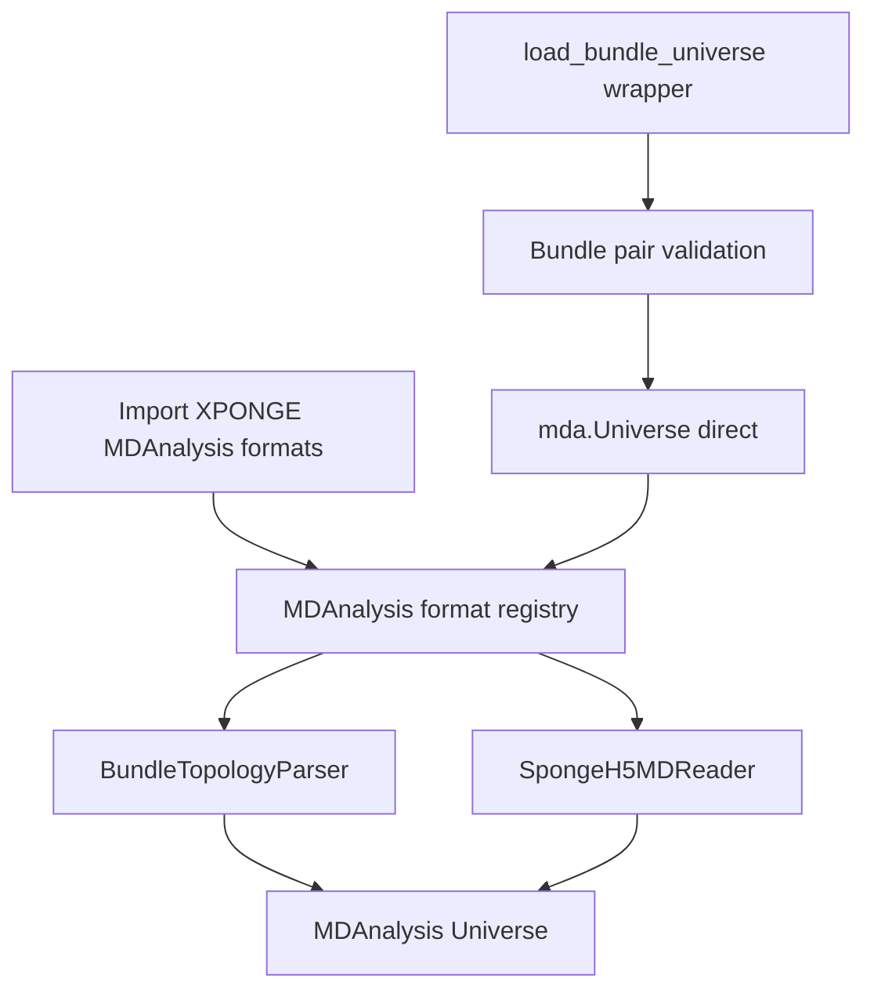

# XPONGE bundle I/O 的 MDAnalysis 生产接口设计

## 1. 文档状态

- 日期：2026-07-13
- 目标分支：`feat/io-bundle-converter`
- 状态：设计完成，待实现
- 范围：为 `topology.spgt.h5` 与 `trajectory.spg.h5md` 提供不依赖 mdin 的稳定 MDAnalysis 读取接口

## 2. 背景与结论

bundle I/O 已经能生成和校验 topology、restart、rerun trajectory 与 output H5MD，但当前 MDAnalysis 接口仍面向 legacy 文件：

- `SpongeInputReader` 从 `<prefix>_mass.txt` 等分文件构造 topology
- `SpongeTrajectoryReader` 读取裸 `float32 .dat` 和独立 `.box`
- `SPONGEH5MDReader` 读取旧的 `/particles/trajectory*` walker 布局
- `load_Sponge_trajectory()` 要求调用者分别传入 topology、trajectory 和 box

旧 walker 布局本身仍是有效的 SPONGE 历史格式，不应因 bundle 上线而弃用。当前 `SPONGEH5MDReader` 的问题是实现只覆盖旧布局且分支状态管理不完整，不能原样作为 bundle 的生产接口：

1. 新 bundle 的粒子流是 `/particles/all`，不是 `/particles/trajectory*`。
2. native H5MD 回退分支仍按 `walker >= 0` 访问未初始化的 `_n_frames`、`_n_atoms` 和 `ts`。
3. 它只填充 position，不填充 time、step、box、velocity 和 force。
4. `_reopen()` 没有重置自管 reader，EOF 判断存在 off-by-one 风险。
5. 通过 `mda._READERS` 等私有全局字典注册，并以 `.h5md` 后缀捕获所有 H5MD 文件，会覆盖 MDAnalysis 自带 reader。
6. bundle 的 `/observables/all/...` 是 SPONGE 扩展布局，不能直接交给 native H5MDReader 的 flat `/observables/{name}` 逻辑。

核心结论：新增 bundle-to-MDAnalysis 适配层，将 topology parser 和 trajectory reader 注册进 MDAnalysis，并以 `mda.Universe(..., topology_format="SPONGE_TOPOLOGY_H5", format="SPONGE_H5MD")` 作为真正的公共入口。`load_bundle_universe()` 只是跨文件强校验包装。mdin、protocol 和 restart 不属于读取依赖。trajectory 使用一个统一的 `SpongeH5MDReader`，在内部根据文件 schema/layout 分流到 bundle stream、legacy walker 或标准 H5MD backend；现有 `SPONGEH5MDReader` 名称保留为兼容入口，不发弃用警告。

### 2.1 “只需要 topology + trajectory”结论审查

该结论对 MDAnalysis 主分析路径成立：

- topology 提供固定的粒子身份、分组、质量、电荷和连接关系
- trajectory 提供逐帧 position，并可提供 box、velocity、force、time、step 和 observables
- protocol 描述模拟如何运行，不参与 `MDAnalysis.Topology` 或 `Timestep` 的构造
- restart 是某一时刻的状态快照；当 trajectory 已包含要分析的帧时，不提供额外必需信息
- mdin 只绑定文件路径和运行选项，不应成为解析两个自描述 HDF5 文件的前置条件

需要补足的不是 mdin，而是两个文件自身的配对信息。当前实现可以用 atom count 排除明显不匹配，但两个体系可能原子数相同、原子顺序不同。因此生产 trajectory 必须记录生成它的 `topology_hash` 和 `atom_order_hash`；reader 优先校验 hash，再校验 atom count。旧 trajectory 缺少 hash 时，只有显式允许弱校验才能兼容读取。

## 3. 目标与非目标

### 3.1 目标

- 将 topology parser 和 trajectory reader 注册为 MDAnalysis format，并以 `MDAnalysis.Universe` 作为主入口
- 从 topology 与 trajectory 两个显式路径构造 `MDAnalysis.Universe`
- 两个文件自描述 schema、particle stream、单位及 topology compatibility，不依赖 mdin
- topology 中暴露 atom/residue 名称、类型、质量、电荷、键和常用高阶连接关系
- trajectory 中暴露 position、box、velocity、force、time、step
- 支持随机访问、切片、重复遍历、VDS 和正常资源释放
- 严格校验 topology/trajectory 原子顺序与维度
- 不读取整条轨迹到内存，每帧读取复杂度为 `O(n_atoms)`
- 保持 legacy walker H5MD 与 legacy MDAnalysis 调用可用

### 3.2 非目标

- 第一阶段不提供 MDAnalysis 到完整 SPONGE bundle 的反向 writer
- 第一阶段不支持运行中 SWMR tail/follow
- 不从 bundle 重建完整 XPONGE `Molecule`
- 不读取或校验 mdin、protocol、restart
- 不允许多个 topology 或 particle stream 在同一个 `Universe` 中动态切换
- 不依赖 MDAnalysis 的私有 `_READERS`、`_PARSERS` 或 H5MDReader 内部字段

## 4. 公共 API

### 4.1 主接口：MDAnalysis format registry

新增模块 `Xponge/analysis/bundle_mdanalysis.py`，定义并通过 MDAnalysis metaclass 注册两个格式：

```python
class BundleTopologyParser(TopologyReaderBase):
    format = "SPONGE_TOPOLOGY_H5"

class SpongeH5MDReader(ReaderBase):
    format = "SPONGE_H5MD"
```

`SPONGE_H5MD` 沿用现有格式名，兼容 legacy walker 和新 bundle stream。注册完成后的标准调用是正式公共接口：

```python
import MDAnalysis as mda
import Xponge.analysis.md_analysis  # 幂等注册 XPONGE formats

u = mda.Universe(
    "run/bundle/topology.spgt.h5",
    "run/output/prod.spg.h5md",
    topology_format="SPONGE_TOPOLOGY_H5",
    format="SPONGE_H5MD",
    particle_stream="all",
)
```

用户传 format 字符串，不需要导入或传递 reader class。`mda.Universe` 负责 parser/reader 实例化、atom-count 协调、trajectory 生命周期和后续 Writer/analysis 生态集成。

注册生命周期：

- `Xponge.analysis.bundle_mdanalysis` 定义类时由 `TopologyReaderBase`/`ReaderBase` metaclass 完成注册
- `Xponge.analysis.md_analysis` 导入并重新导出这些类，因此保留现有用户入口
- 重复 import/register 必须幂等，不能直接修改 `mda._READERS`、`mda._PARSERS` 等私有字典
- 可提供 `register_mdanalysis_formats()` 作为显式 bootstrap；函数只触发模块导入并返回已注册 format 名，不重复维护 registry

format hint 用于便捷自动识别：topology hint 检查 `sponge.topology.h5` schema，trajectory hint 检查 bundle schema 或 legacy walker layout。因此完成注册后可支持：

```python
u = mda.Universe("topology.spgt.h5", "prod.spg.h5md")
```

显式 format 字符串仍是文档中的推荐写法，因为它不依赖扩展名和 hint 调度顺序。

### 4.2 包装接口

`load_bundle_universe()` 是上述注册接口的严格包装，不拥有第二套 parser/reader：

```python
def load_bundle_universe(
    topology,
    trajectory,
    *,
    particle_stream=None,
    strict=True,
    allow_unverified_pair=False,
    allow_incomplete=False,
    convert_units=True,
    **universe_kwargs,
):
    """Return an MDAnalysis Universe backed by a SPONGE bundle."""
```

推荐用法：

```python
from Xponge.analysis.bundle_mdanalysis import load_bundle_universe

u = load_bundle_universe(
    "run/bundle/topology.spgt.h5",
    "run/output/prod.spg.h5md",
)
protein = u.select_atoms("protein")
for ts in u.trajectory[::10]:
    print(ts.frame, ts.time, ts.data["step"], protein.center_of_mass())
```

参数语义：

- `topology`：`topology.spgt.h5` 路径
- `trajectory`：生产或输入的 `*.spg.h5md` 路径；两者对 MDAnalysis reader 没有语义差异
- `particle_stream`：显式选择 `/particles/{stream}`；省略时从 trajectory 的 stream table 推断
- `strict`：启用 schema、shape、hash、unit 与 completion 校验
- `allow_unverified_pair`：仅为旧 bundle trajectory 提供兼容；缺少 compatibility hash 时允许退化为 atom-count 校验并发出 warning
- `allow_incomplete`：默认拒绝未 finalized 的 output；显式开启时只暴露各必需 dataset 的共同完整前缀
- `convert_units`：转换到 MDAnalysis 基本单位
- `universe_kwargs`：仅传给 `MDAnalysis.Universe`；与 validation/reader 参数同名时由 wrapper 显式拆分，禁止静默覆盖

helper 的实现语义固定为：

```python
def load_bundle_universe(topology, trajectory, **kwargs):
    validate_bundle_pair(topology, trajectory, **validation_kwargs)
    return mda.Universe(
        topology,
        trajectory,
        topology_format="SPONGE_TOPOLOGY_H5",
        format="SPONGE_H5MD",
        **reader_and_universe_kwargs,
    )
```

helper 只增加 MDAnalysis 分离 parser/reader 生命周期无法自动完成的跨文件 topology/atom-order hash 校验，以及 `allow_unverified_pair`、`allow_incomplete` 的生产安全策略。真正的数据读取始终走已注册格式。

stream 推断规则固定为：

1. 显式 `particle_stream`
2. `/parameters/sponge/output/particle_streams` 只有一个值时使用该值
3. `/particles` 下只有一个 group 时使用该 group
4. 多个候选且未显式选择时立即报错

不得根据 group 创建顺序选择“第一个”stream。

高级用户仍可传 class 对象；它与 format 字符串解析到同一实现：

```python
u = mda.Universe(
    "topology.spgt.h5",
    "prod.spg.h5md",
    topology_format=BundleTopologyParser,
    format=SpongeH5MDReader,
    particle_stream="all",
)
```

## 5. 目标架构



职责边界：

- `Bundle pair validation`：接收两个显式路径，校验 schema、compatibility hash、原子数、stream、unit 和 frame completion
- `MDAnalysis format registry`：正式的 parser/reader 发现与实例化入口
- `BundleTopologyParser`：单个 topology 文件到 MDAnalysis `Topology`
- `SpongeH5MDReader`：自动识别 bundle stream 或 legacy walker，并输出逐帧 `Timestep`
- `load_bundle_universe`：先做严格 pair validation，再包装调用 `mda.Universe` 的注册格式

现有 `BundleReader` 与 `BundleCase`/mdin 绑定，不能直接作为这个入口的前置条件。实现时应抽取接收显式 HDF5 handle/path 的 artifact validation helpers，供 `BundleReader` 和 MDAnalysis factory 共同复用，避免复制 schema 校验。预检完成后关闭 validation handle；MDAnalysis reader 自己打开并拥有 trajectory handle，避免双重关闭与生命周期泄漏。

## 6. 文件自描述与配对

MDAnalysis 首版接口不发现路径。调用者必须显式提供 topology 与 trajectory，文件内容负责描述其格式和配对关系：

| 文件 | 路径 | 用途 |
| --- | --- | --- |
| topology | `/schema/name`, `/schema/version` | topology schema 识别 |
| topology | `/topology/topology_hash` | 完整 topology 身份 |
| topology | `/topology/atom_order_hash` | 原子顺序身份 |
| trajectory | `/parameters/sponge/schema/name`, `/parameters/sponge/schema/version` | trajectory schema 识别 |
| trajectory | `/parameters/sponge/topology_compatibility/topology_hash` | 声明配套 topology |
| trajectory | `/parameters/sponge/topology_compatibility/atom_order_hash` | 声明配套原子顺序 |
| trajectory | `/parameters/sponge/output/particle_streams` | 可选 particle stream 列表 |

trajectory finalizer 必须接受 topology compatibility metadata 并写入两个 hash。生产运行应在载入 topology 时复制这些值到输出 trajectory；`BundleBuilder` 同时生成 topology/trajectory 时可直接使用已有 `BundleMetadata`。legacy output importer 若无法定位来源 topology，可以不写 hash，但生成的文件只能进行 atom-count 弱校验，manifest 必须记录 `topology_compatibility_unverified`。

配对校验顺序：

1. 两个 schema 分别合法
2. trajectory 声明的 `topology_hash` 与 topology 相等
3. trajectory 声明的 `atom_order_hash` 与 topology 相等
4. position 的 atom dimension 与 `/topology/atom_count` 相等

hash 不一致始终失败。旧 bundle trajectory 缺 hash 时，`strict=True` 默认失败；只有显式 `allow_unverified_pair=True` 才允许退化为 atom-count 校验，并发出 warning。该开关应与 `allow_incomplete` 分离，因为“文件未写完”和“文件配对未经证明”是两种不同风险。

## 7. Topology 映射

`BundleTopologyParser.parse()` 只读取 topology HDF5，不读取 trajectory。

| MDAnalysis 属性 | bundle 路径 | 规则 |
| --- | --- | --- |
| atom count | `/topology/atom_count` | 必需，标量正整数 |
| `Atomids` | 派生 | `1..N` |
| `Masses` | `/atoms/mass` | 可选，长度必须为 N |
| `Charges` | `/atoms/charge` | 可选，从 Amber/SPONGE charge 转为 `e` |
| `Atomnames` | `/parameters/xponge/atoms/name` | 缺失时按 element 或 `A{index}` 猜测并标记 guessed |
| `Atomtypes` | `/parameters/xponge/atoms/type_name` | 缺失时复用 guessed atom name |
| `Elements` | 由 mass/name 猜测 | 标记 guessed |
| atom-to-residue | `/atoms/residue_index` | 可选；缺失时全部属于 residue 0 |
| residue count | `/residues/atom_offset` | 与 residue index 交叉校验 |
| `Resids`, `Resnums` | 派生 | `1..R` |
| `Resnames` | `/parameters/xponge/residues/name` | 缺失时填 `SYSTEM` |
| `Segids` | 派生 | 单一 `SYSTEM` segment |
| `Bonds` | `/forcefield/bond/atoms` | 可选，去重并校验索引范围 |
| `Angles` | `/forcefield/angle/atoms` | 可选 |
| `Dihedrals` | `/forcefield/dihedral/atoms` | 可选 |
| `Impropers` | `/forcefield/improper/atoms` | 可选 |

电荷是一个必须修正的单位边界。legacy `charge_in_file` 保存的是 `atom.charge * 18.2223`，当前 typed parser 原样写入 `/atoms/charge`。实现时应在 builder finalize 中给 `/atoms/charge` 写 `unit="Amber"`；MDAnalysis reader 将其转换为基本单位 `e`。对已经生成且没有 unit attr 的 schema v1 bundle，按既有格式解释为 Amber/SPONGE charge，并在非严格兼容模式记录 warning。

所有字符串 dataset 统一处理 variable-length UTF-8、fixed bytes 和 NumPy bytes，不把 `b"CA"` 暴露给 MDAnalysis。

## 8. Trajectory 映射

`SpongeH5MDReader` 是统一入口，直接继承公开的 `ReaderBase`。它不把旧 walker 格式等同于过时格式，而是在打开文件后先选择 layout adapter，再由共享的逐帧读取核心生成 `Timestep`。

低层构造参数：

```python
SpongeH5MDReader(
    filename,
    n_atoms=None,
    *,
    layout="auto",          # auto | bundle | legacy | h5md
    particle_stream=None,   # bundle layout
    walker=None,            # legacy layout，省略时为 0
    convert_units=True,
    **reader_kwargs,
)
```

### 8.1 Layout 分流

`layout="auto"` 按文件内容而不是扩展名分流：

1. `/parameters/sponge/schema/name == "sponge.output.h5md"`：选择 bundle adapter
2. 否则，`/particles` 下存在 `trajectory`，或所有候选都匹配 `trajectory{整数}`：选择 legacy walker adapter
3. 否则，文件满足普通 H5MD 基础结构：显式使用 reader 时转交 native H5MD backend
4. 同时出现互相冲突的 marker/layout 且不能由 schema 唯一解释：报 `AmbiguousH5MDLayoutError`

正式 schema marker 的优先级高于 group 名。因此一个 bundle stream 即使叫 `trajectory`，也仍按 bundle 处理。禁止用 `/particles` 的第一个 key 猜 layout 或 walker。

adapter 职责：

- bundle adapter：按 `particle_stream` 或 stream table 选择 `/particles/{stream}`，启用 schema、completion、hash 与 nested observables 语义
- legacy adapter：单 walker 使用 `/particles/trajectory`；多 walker 按数值后缀排序并使用 `/particles/trajectory{walker}`
- native adapter：只服务用户显式把普通 H5MD 交给 `SpongeH5MDReader` 的兼容场景

`particle_stream` 只允许用于 bundle layout，`walker` 只允许用于 legacy layout；参数与检测结果冲突时明确报错。旧调用中的 positional/keyword `n_atoms` 继续接受，但同时与 position shape 校验；新调用可省略并由文件推断。

bundle 与 legacy adapter 共用 position/velocity/force/box/time/step 的 frame engine。旧文件只有 position 时保持原行为；如果旧文件含标准 H5MD 可选字段，则新 reader 一并暴露，不需要继续维持“只读 position”的实现限制。

`load_bundle_universe()` 的严格 pair validation 面向 bundle topology + bundle trajectory；legacy walker 兼容位于低层 reader，不要求旧用户迁移 topology 或补造 bundle hash。原有调用继续采用 legacy topology reader，例如：

```python
u = mda.Universe(
    "system_mass.txt",
    "legacy.h5md",
    topology_format="SPONGE_MASS",
    format=SpongeH5MDReader,
    walker=1,
)
```

bundle adapter 选定 stream 的根为 `/particles/{particle_stream}`；legacy adapter 将选定 walker group 规范化为同一内部 particle-group 接口。

| Timestep 字段 | bundle 路径 | 行为 |
| --- | --- | --- |
| `positions` | `position/value` | 必需，shape `(F,N,3)` |
| `velocities` | `velocity/value` | 可选，存在时 shape 必须完全匹配 |
| `forces` | `force/value` | 可选，存在时 shape 必须完全匹配 |
| `dimensions` | `box/edges/value` | 可选，将每帧 3x3 edge matrix 转为 `[A,B,C,alpha,beta,gamma]` |
| `time` | `position/time`，再回退 stream `time` | 可选；strict production output 要求存在 |
| `data["step"]` | `position/step`，再回退 stream `step` | 可选；strict production output 要求存在 |

读取规则：

- `n_atoms` 从 position shape 得到，并与 topology atom count 再校验
- `n_frames` 取必需与已声明逐帧 dataset 的共同完整前缀；finalized 文件中所有 frame count 必须相等
- `_read_frame(i)` 使用 HDF5 单帧 hyperslab，不执行 `dataset[...]` 全量加载
- `_read_next_timestep()` 只调用 `_read_frame(current + 1)`
- `_reopen()` 重新打开文件并将 frame 置为 `-1`
- `close()` 幂等
- `parse_n_atoms()` 使用同一 layout/stream/walker 检测规则读取 position shape
- VDS 由 h5py 透明读取；reader 不感知 shard 实现
- `dt` 仅在 time axis 至少有两个点且间隔一致时设置；不一致轨迹以每帧 `ts.time` 为准
- `ts.data["step"]` 保留真实 simulation step，不能用 MDAnalysis frame index 替代

单位转换目标采用 MDAnalysis 基本单位：length `Å`、time `ps`、velocity `Å/ps`、force `kJ/(mol·Å)`、charge `e`。因此当前 `kcal mol-1 Angstrom-1` force 在 `convert_units=True` 时乘以 `4.184`；position、time 和 velocity 当前无需数值变化。未知或缺失单位在 strict 模式报 `BundleUnitError`，不能假定。

## 9. H5MD 元数据补齐

当前 `BundleBuilder` 已写 `/h5md` version、creator、value unit 与 step/time hard link，但没有给 `/particles/all/box` 写 native H5MD 要求的 attrs。实现 MDAnalysis 接口时同步补齐 trajectory 的共享 finalizer 和 legacy output finalizer：

```text
/particles/{stream}/box.attrs["dimension"] = 3
/particles/{stream}/box.attrs["boundary"] = ["periodic", "periodic", "periodic"]
```

无 box edges 时 boundary 为三个 `"none"`。这使 bundle 本身更接近标准 H5MD，也允许外部工具读取；XPONGE 注册格式仍使用专用 reader，以保证 stream 与 SPONGE observables 语义。

finalizer 还必须保证：

- position/velocity/force/box 的 `step` 和 `time` 为 hard link 或内容严格相同
- time dataset 带 `unit="ps"`
- 所有 value dataset 带规范 H5MD unit 字符串
- `/parameters/sponge/output/status` 和 completion 字段与实际完整帧一致

## 10. Observables 策略

第一阶段仅把与 particle frame 一一对齐、位于同一文件 `/observables/{stream}/.../value` 的叶子值放入 `ts.data`。key 使用相对路径，例如：

```python
ts.data["observables/energy/potential"]
ts.data["observables/thermostat/nose_hoover_chain/coordinate"]
```

禁止只用叶子名，以免不同分组发生碰撞。只有 group 自身的 step/time 与当前 particle step 相同，或二者共享同一 HDF5 object 时才认为对齐。

独立 observable 文件不属于 topology + trajectory 首版接口，registered reader 和 wrapper 都不发现或打开第三个文件。后续如有需求，单独提供接收显式 observable 路径的 `BundleObservableAuxReader`，按 simulation step 与 trajectory 对齐并通过 `ts.aux` 暴露。

## 11. 校验与错误模型

在 `Xponge/io_bundle/errors.py` 增加：

```python
class BundleMDAnalysisError(BundleValidationError): ...
class BundleTopologyError(BundleMDAnalysisError): ...
class BundleTrajectoryError(BundleMDAnalysisError): ...
class BundleUnitError(BundleMDAnalysisError): ...
class UnverifiedBundlePairError(BundleMDAnalysisError): ...
class IncompleteBundleError(BundleMDAnalysisError): ...
class AmbiguousH5MDLayoutError(BundleTrajectoryError): ...
```

校验分为三层：

- `BundleTopologyParser` 在 parse 时校验 topology 自身的 schema、维度、字符串和 connectivity
- `SpongeH5MDReader` 在初始化时校验 trajectory 自身的 layout、stream、shape、unit 和 completion；`mda.Universe` 校验 topology/trajectory atom count
- `validate_bundle_pair()`/`load_bundle_universe()` 在调用 `mda.Universe` 前额外比较两个文件的 topology/atom-order hash

因此直接使用注册格式已经是完整可用的 MDAnalysis 接口；需要生产级强配对证明时，先调用 `validate_bundle_pair()` 或使用 wrapper。校验项包括：

1. schema name/version 正确
2. trajectory 的 topology/atom-order compatibility hash 与 topology 一致
3. topology atom count 与 position/velocity/force 的 N 一致
4. particle stream 存在且有 position
5. 所有逐帧数组 shape 和 frame count 一致
6. box 为 `(F,3,3)`，edge 非零且有限
7. step 单调不减，time 有限且单调不减
8. unit 可识别
9. finalized output 的 completion metadata 与实际 dataset 一致
10. topology connectivity 索引处于 `[0,N)`

错误消息必须包含物理文件、HDF5 path、实际值和期望值，例如：

```text
prod.spg.h5md:/particles/all/velocity/value has shape (99, 2400, 3),
expected (100, 2400, 3) to match position/value
```

## 12. 兼容与迁移

- `SpongeInputReader`、`SpongeTrajectoryReader` 和 `load_Sponge_trajectory()` 保持行为不变
- `SPONGEH5MDReader` 不弃用；它作为 `SpongeH5MDReader` 的兼容导出，保留 `walker`、`n_atoms` 和原有 import path
- 旧 `/particles/trajectory*` 布局继续是一等支持格式，不能只做一次性转换或 silent fallback
- 删除对 `mda._READERS`、`mda._PARSERS` 等私有 registry 的直接写入；新类依靠 MDAnalysis reader metaclass 的 `format` 与 `_format_hint` 注册，wrapper 通过 format 字符串调用 `mda.Universe`
- `_format_hint` 可只读打开 `.h5md` 检查 SPONGE schema 或 legacy walker group；普通第三方 H5MD 返回 `False`，继续交给 MDAnalysis 原生 reader
- 用户显式指定 `format=SpongeH5MDReader` 读取普通 H5MD 时，由内部 native adapter 处理
- `load_Sponge_trajectory()` 可在后续增加 bundle 检测，但首版不做参数重载，避免旧三路径接口出现歧义

## 13. 测试矩阵

新增 `Xponge/tools/unittests/test_1_io_bundle_mdanalysis.py`，用 `pytest.importorskip("MDAnalysis")` 隔离可选环境。

### 13.1 Topology

- 完整 names/types/resnames/mass/charge/connectivity 映射
- 缺少可选 metadata 时的 guessed 属性
- Amber/SPONGE charge 到 `e` 的转换
- residue offset/index 不一致
- bond/angle/dihedral/improper 越界与去重
- bytes、UTF-8 string dataset 解码

### 13.2 Trajectory

- bundle schema 到 bundle adapter 的自动分流
- legacy 单 walker `/particles/trajectory` 的兼容读取
- legacy 多 walker `/particles/trajectory0..N` 的选择、数值排序和越界错误
- bundle stream 名为 `trajectory` 时仍由 schema marker 选择 bundle adapter
- mixed/ambiguous layout 确定性失败
- 显式 `layout` 与 `walker`/`particle_stream` 参数冲突错误
- 普通 H5MD 显式调用时的 native adapter
- position-only、position+velocity、position+velocity+force
- 正交盒与 triclinic 盒
- time、step、dt 与随机访问
- 正向、反向切片和重复遍历
- EOF、`close()`、`_reopen()` 和 context cleanup
- unit conversion，尤其 kcal force 到 kJ force
- frame count/shape 不一致错误
- VDS trajectory 与普通单文件结果逐帧一致

### 13.3 Format 注册与统一入口

- import 后 `SPONGE_TOPOLOGY_H5` 和 `SPONGE_H5MD` 可由 MDAnalysis format registry 解析
- `mda.Universe(..., topology_format="SPONGE_TOPOLOGY_H5", format="SPONGE_H5MD")` 端到端读取
- format 字符串与直接传 class 的结果一致
- topology/trajectory `_format_hint` 可自动识别自身格式
- 重复 import 和 `register_mdanalysis_formats()` 幂等
- 普通第三方 `.h5md` 不匹配 SPONGE hint

### 13.4 Wrapper 与文件配对

- topology/trajectory 显式路径
- bundle 目录中没有 mdin、protocol、restart 时仍可正常构造 `Universe`
- topology hash 与 atom-order hash 匹配、缺失和冲突
- `allow_unverified_pair=True` 的旧文件弱校验与 warning
- 非 `all` particle stream
- 单 stream 自动推断与多 stream 歧义错误
- finalized/completion 校验
- `allow_incomplete=True` 只暴露共同完整前缀
- topology/trajectory atom count 不一致
- wrapper 返回的 `Universe` 与直接注册格式入口逐属性、逐帧一致

### 13.5 MDAnalysis 行为验收

- `u.select_atoms()` 可按 name、type、resname、protein 语义工作
- `u.atoms.charges` 为电子电荷单位
- `u.trajectory.ts.dimensions` 正确
- RMSD、RMSF、radius of gyration 各跑一个小型 smoke
- `u.transfer_to_memory()` 与直接读取结果一致
- 普通第三方 `.h5md` 未被 XPONGE reader 劫持
- 现有 `SPONGEH5MDReader(..., walker=N)` 调用无需修改且不发弃用警告

首版支持矩阵至少覆盖 MDAnalysis 2.9 和当前稳定 2.x。MDAnalysis 3.0 发布后单独验证，不提前依赖其未稳定 API。

## 14. 实施顺序

### 阶段 A：schema 与 reader 基础

1. 在 trajectory finalizer 补齐 H5MD box attrs、stream table 和 topology compatibility hash
2. 在 topology finalizer 补齐 charge unit
3. 从 `BundleReader` 抽取不依赖 `BundleCase` 的 artifact/pair validation helpers
4. 实现 `BundleTopologyParser`
5. 实现统一 `SpongeH5MDReader`、layout detector 与 bundle/legacy/native adapters

### 阶段 B：公共入口

6. 通过 MDAnalysis metaclass 注册 `SPONGE_TOPOLOGY_H5` 与 `SPONGE_H5MD`
7. 实现 schema-aware `_format_hint` 和幂等 `register_mdanalysis_formats()`
8. 实现接收两个显式路径、最终调用注册格式的 `load_bundle_universe()`
9. 增加 stream 自描述选择和同文件逐帧对齐的 observables 映射
10. 更新 README/API 文档和 `traj_analysis` 的内部调用点

### 阶段 C：兼容清理

11. 将现有 `SPONGEH5MDReader` import path 无警告地指向统一 reader
12. 移除私有 registry 写入和通用 `.h5md` 后缀捕获
13. 跑 bundle 聚焦测试、MDAnalysis smoke、legacy walker 和 legacy trajectory 回归

### 后续阶段

14. `BundleObservableAuxReader` 接收显式 observable 文件并支持不同采样频率
15. 根据真实需求评估 SWMR live reader 和 MPI HDF5

## 15. 完成标准

只有同时满足以下条件，才能认为 MDAnalysis 接口可以进入生产：

- 用户只传 topology 与 trajectory 两个路径即可得到 `Universe`，无需 mdin、protocol、restart 或独立 box
- 用户能通过 MDAnalysis format 字符串和 `mda.Universe` 直接读取，不要求调用 XPONGE helper
- `load_bundle_universe()` 被证明只是注册格式入口的校验包装，读取结果完全一致
- trajectory 能用 topology/atom-order hash 证明与 topology 正确配对
- topology、position、box、velocity、force、time、step 的数值与 bundle dataset 一致且单位正确
- finalized 与 VDS trajectory 均通过测试
- 损坏或部分写入 bundle 在默认模式下确定性失败
- 大轨迹随机读取不发生全量内存加载
- legacy reader 回归不变，普通 H5MD 不被 XPONGE 劫持
- legacy 单/多 walker 与 bundle stream 均由同一公开 reader 确定性分流
- 文件 handle 在正常、异常和重复打开路径中均可释放

## 16. 外部接口依据

设计遵循 MDAnalysis 2.x 的公开接口：topology parser 从 `TopologyReaderBase` 派生并由 `parse()` 返回 `Topology`；trajectory reader 从 `ReaderBase` 派生；H5MD 使用 `/particles/{group}`、box dimension/boundary、per-component step/time/value 和 unit attrs；MDAnalysis 基本单位为 Å、ps、e 和 kJ/(mol·Å)。实现中不得复制或依赖 MDAnalysis 私有 registry 与 reader 内部状态。
